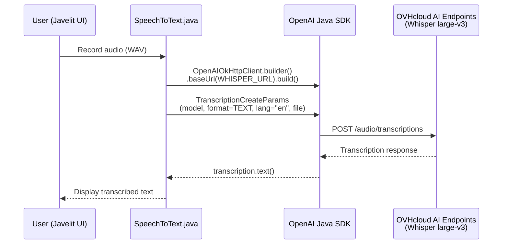
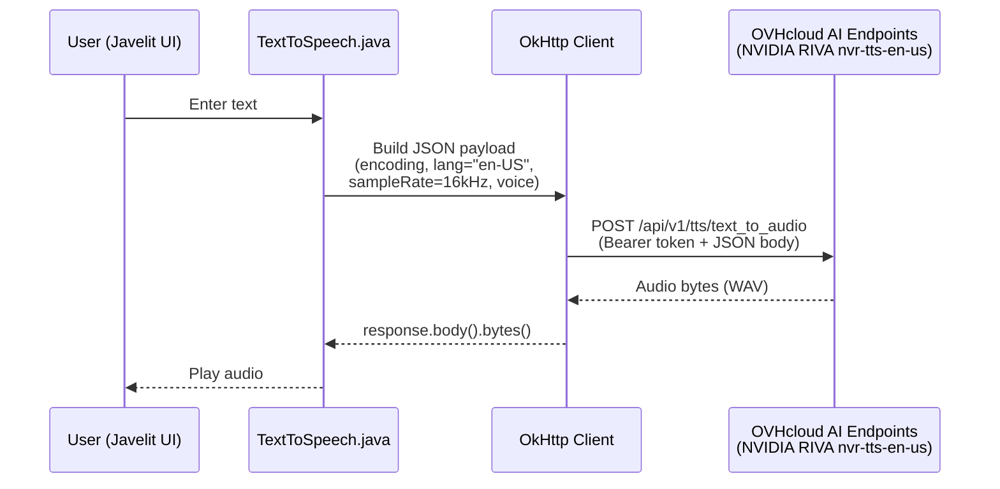

## 🎙️ Audio module for AI Endpoints workshop 🎙️

**ℹ️ All solutions to this part are in the [solutions/audio/java](../../../solutions/audio/java) folder. ℹ️**

### ⚠️ Prerequisites ⚠️

If you use [Coder CDE](https://coder.com/) to open this project, all prerequisites are managed for you.  
In the other case you need: 
 - A Java 21+ JDK with preview activated or Java 25+
 - [JBang](https://www.jbang.dev/) 
 - [Javelit](https://javelit.io/)

> Note: This module uses these libraries:
>  - [OpenAI Java SDK](https://github.com/openai/openai-java):  for Whisper speech-to-text
>  - [OkHttp](https://square.github.io/okhttp/):  for NVIDIA RIVA text-to-speech HTTP calls
>  - [LangChain4j](https://docs.langchain4j.dev/intro/):  for LLM-powered translation (Module 3)
>  - [Javelit](https://javelit.io/):  for building the audio UI

### 📚 What you'll learn 📚

In this workshop, you'll build audio applications using **OVHcloud AI Endpoints**. The workshop is divided into progressive modules:

1. 🎤 **Speech to Text** - Transcribe audio using Whisper model
2. 🔊 **Text to Speech** - Generate speech using NVIDIA RIVA model
3. 🌍 **Speech to Speech + Translation** - Full pipeline: English speech -> LLM translation -> Spanish speech

---

## 🚀 Getting Started 🚀

### 🔧 Step 0: Project Setup

All files are already created for you in [workshop/audio/java](./)!

The project uses **JBang**, a Java scripting tool that allows running Java code without complex project setup, and **Javelit**, a library for building audio UIs.

📖 **Learn more**: [JBang Documentation](https://www.jbang.dev/) | [Javelit Documentation](https://javelit.io/)

### ▶️ Running Your Code

All exercises can be run using the helper script:

```bash
./run-javelit-main.sh <FileName>
```

For example:
```bash
./run-javelit-main.sh SpeechToText.java
```

🎯 **Tip**: JBang automatically handles dependencies defined in the Java file headers (the `//DEPS` lines)!

---

### 💡 Using VS Code Snippets 💡

This workshop provides **VS Code code snippets** as progressive hints to help you if you get stuck.

**How to use them:**
1. 📂 Open the Java file you're working on in VS Code
2. 📍 Place your cursor where you want to insert the code
3. ⌨️ Type the snippet prefix (e.g., `java-41`)
4. ✅ Press `Tab` or select the snippet from the autocomplete dropdown
5. ✨ The code will be automatically inserted!

> 📌 **Note**: Snippets are provided as a **last resort** hint (Level 3).
> Try to solve each step using the documentation and key classes hints first!
> The learning experience is much better when you write the code yourself! 💪

---

## 🎤 Module 1: Speech to Text 🎤

**Goal**: Transcribe audio into text using the **Whisper** model for automatic speech recognition (ASR).


### 🎯 Architecture Overview



**File to edit**: [SpeechToText.java](SpeechToText.java)

**Audio file**: [example.wav](../example.wav)

### 📝 Step 1.1: Initialize the OpenAI Client & Configure Whisper

Set up the OpenAI-compatible client pointing to the [Whisper endpoint](https://www.ovhcloud.com/en/public-cloud/ai-endpoints/catalog/whisper-large-v3/), and configure the transcription parameters.

💡 **Key Concepts**:
- The Whisper model is exposed via an **OpenAI-compatible API** on AI Endpoints
- You configure the client with the Whisper-specific URL and access token
- Transcription parameters include: model name, response format (TEXT), language, and audio file

<details>
<summary>🔎 Hint 1 — What concept to use</summary>

Use the **OpenAI Java SDK** (`openai-java`) to create a client that points to the Whisper model on AI Endpoints. The SDK provides an `OpenAIOkHttpClient` builder where you set the `baseUrl` and `apiKey`. Then build a `TranscriptionCreateParams` object to configure the Whisper model (model name, output format, language, audio data).

📖 **Documentation**:
- [OpenAI Java SDK](https://github.com/openai/openai-java)
- [OVHcloud AI Endpoints - Whisper](https://endpoints.ai.cloud.ovh.net/models/whisper-large-v3)

</details>

<details>
<summary>🧩 Hint 2 — Key classes & methods</summary>

- `OpenAIOkHttpClient.builder()`: creates the client builder
  - `.apiKey(System.getenv("OVH_AI_ENDPOINTS_ACCESS_TOKEN"))`:  sets the API key from env
  - `.baseUrl(System.getenv("OVH_AI_ENDPOINTS_WHISPER_URL"))`:  sets the Whisper endpoint URL
  - `.build()`:  builds the `OpenAIClient`
- `TranscriptionCreateParams.builder()`:  configures the transcription
  - `.model(System.getenv("OVH_AI_ENDPOINTS_WHISPER_MODEL"))`:  the Whisper model name
  - `.responseFormat(AudioResponseFormat.TEXT)`:  output as plain text
  - `.language("en")`:  English language
  - `.file(record)`:  the audio bytes
  - `.build()`:  builds the params

</details>

<details>
<summary>🎁 Hint 3 — VS Code snippets (last resort!)</summary>

Type `java-41` in your editor and press **Tab** to insert the OpenAI client initialization, then `java-42` for the Whisper model configuration.

</details>

---

### 📝 Step 1.2: Run the Transcription

Call the Whisper model to transcribe the audio and return the text result.

<details>
<summary>🔎 Hint 1 — What concept to use</summary>

Use the OpenAI client's **audio transcriptions API** to send the configured parameters and get back a `Transcription` object containing the transcribed text.

📖 **Documentation**:
- [OpenAI Audio Transcription API](https://platform.openai.com/docs/api-reference/audio/createTranscription)

</details>

<details>
<summary>🧩 Hint 2 — Key classes & methods</summary>

- `client.audio().transcriptions().create(createParams)`:  sends the transcription request
- `.asTranscription()`:  converts the response to a `Transcription` object
- `transcription.text()`:  extracts the transcribed text as a `String`

</details>

<details>
<summary>🎁 Hint 3 — VS Code snippet (last resort!)</summary>

Type `java-43` in your editor and press **Tab** to insert the transcription call.

</details>

---

### 📝 Step 1.3: Create the Javelit UX

Set up the Javelit UI with an audio input recorder and display the transcription result.

💡 **Key Concept**: [Javelit](https://javelit.io/) provides simple UI components for audio recording and display, no web framework needed!

<details>
<summary>🔎 Hint 1 — What concept to use</summary>

Use **Javelit** to create a simple UI: set a title, add an audio input component for recording, then call your `speechToText()` method with the recorded audio and display the result as text.

📖 **Documentation**:
- [Javelit Documentation](https://javelit.io/)

</details>

<details>
<summary>🧩 Hint 2 — Key classes & methods</summary>

- `Jt.title("Speech to text exercise").use()`:  sets the window title
- `Jt.audioInput("label").use()`:  creates an audio recorder, returns a recording object
- `recording.content()`:  gets the recorded audio as `byte[]`
- `Jt.text("...").use()`:  displays text in the UI
- Call `speechToText(recording.content())` with the recorded bytes

</details>

<details>
<summary>🎁 Hint 3 — VS Code snippet (last resort!)</summary>

Type `java-44` in your editor and press **Tab** to insert the Javelit UX code.

</details>

---

### 🧪 Step 1.4: Test Your Speech to Text

Run the exercise:

```bash
./run-javelit-main.sh SpeechToText.java
```

✅ **Expected**: 
- A Javelit window opens with an audio recorder
- Record or provide an English audio sample
- The transcription appears as text in the UI

---

## 🔊 Module 2: Text to Speech 🔊

**Goal**: Generate speech from text using the **NVIDIA RIVA** text-to-speech model (`nvr-tts-en-us`).


### 🎯 Architecture Overview



**File to edit**: [TextToSpeech.java](TextToSpeech.java)

💡 **Note**: Unlike Module 1 which uses the OpenAI SDK, this module uses **raw HTTP calls** with OkHttp because the NVIDIA RIVA API has its own JSON format (not OpenAI-compatible).

### 📝 Step 2.1: Initialize OkHttp Client & Create RIVA Payload

Set up the HTTP client and build the JSON payload for the NVIDIA RIVA text-to-speech API.

💡 **Key Concepts**:
- NVIDIA RIVA expects a specific JSON structure with encoding, language code, sample rate, text, and voice name
- The voice `English-US.Female-1` is used for English TTS

<details>
<summary>🔎 Hint 1 — What concept to use</summary>

Create a standard **OkHttp client** and build a **JSON payload** as a text block that matches the NVIDIA RIVA TTS API format. The payload specifies audio encoding (1 = PCM), language code (`en-US`), sample rate (16000 Hz), the text to synthesize, and the voice name.

📖 **Documentation**:
- [OkHttp Documentation](https://square.github.io/okhttp/)
- [NVIDIA RIVA TTS Overview](https://docs.nvidia.com/deeplearning/riva/user-guide/docs/tts/tts-overview.html#pretrained-tts-models)
- [OVHcloud AI Endpoints - RIVA TTS](https://endpoints.ai.cloud.ovh.net/models/nvr-tts-en-us)

</details>

<details>
<summary>🧩 Hint 2 — Key classes & methods</summary>

- `new OkHttpClient()`:  creates the HTTP client
- Build a JSON payload string (use a text block `"""..."""`) with:
  - `"encoding": 1`:  PCM encoding
  - `"language_code": "en-US"`:  English US
  - `"sample_rate_hz": 16000`:  16 kHz sample rate
  - `"text": "%s"`:  placeholder for the text to synthesize (use `String.format()`)
  - `"voice_name": "English-US.Female-1"`:  the voice to use

</details>

<details>
<summary>🎁 Hint 3 — VS Code snippets (last resort!)</summary>

Type `java-45` in your editor and press **Tab** to insert the OkHttp client initialization, then `java-46` for the RIVA JSON payload.

</details>

---

### 📝 Step 2.2: Create the Request & Call the Endpoint

Build the HTTP request with authentication and call the RIVA endpoint to generate audio.

<details>
<summary>🔎 Hint 1 — What concept to use</summary>

Create an OkHttp `Request` with the RIVA TTS endpoint URL, a `Bearer` authorization header (using your AI Endpoints access token), and the JSON payload as the POST body. Execute the request and read the response body as raw bytes:  this is the generated audio.

📖 **Documentation**:
- [OkHttp Requests](https://square.github.io/okhttp/recipes/#synchronous-get-kt-java)
- [OVHcloud AI Endpoints - RIVA TTS](https://endpoints.ai.cloud.ovh.net/models/nvr-tts-en-us)

</details>

<details>
<summary>🧩 Hint 2 — Key classes & methods</summary>

- `RequestBody.create(String.format(payload, textToEncode), MediaType.get("application/json; charset=utf-8"))`:  creates the request body
- `new Request.Builder()`:  builds the HTTP request
  - `.url("https://nvr-tts-en-us.endpoints.kepler.ai.cloud.ovh.net/api/v1/tts/text_to_audio")`:  RIVA endpoint
  - `.addHeader("Authorization", String.format("Bearer %s", System.getenv("OVH_AI_ENDPOINTS_ACCESS_TOKEN")))`:  auth header
  - `.header("accept", "application/octet-stream")`:  expect binary audio
  - `.post(body)`:  POST method
- `client.newCall(request).execute()`:  sends the request
- `response.body().bytes()`:  gets the audio as `byte[]`

</details>

<details>
<summary>🎁 Hint 3 — VS Code snippets (last resort!)</summary>

Type `java-47` in your editor and press **Tab** to insert the request with bearer token, then `java-48` to call the endpoint and get the audio bytes.

</details>

---

### 📝 Step 2.3: Create the Javelit UX

Set up the Javelit UI with a text input area and audio playback.

<details>
<summary>🔎 Hint 1 — What concept to use</summary>

Use **Javelit** to create a UI with a text area for input and an audio player for output. The user types text, you call your `textToSpeech()` method, then play the resulting audio.

📖 **Documentation**:
- [Javelit Documentation](https://javelit.io/)

</details>

<details>
<summary>🧩 Hint 2 — Key classes & methods</summary>

- `Jt.title("Text to speech exercise").use()`:  sets the window title
- `Jt.textArea("label").use()`:  creates a text area input, returns the entered `String`
- Call `textToSpeech(englishText)` with the user's text to get `byte[]` audio
- `Jt.audio(audioBytes).format("audio/wav").use()`:  plays the generated audio

</details>

<details>
<summary>🎁 Hint 3 — VS Code snippet (last resort!)</summary>

Type `java-49` in your editor and press **Tab** to insert the Javelit UX code.

</details>

---

### 🧪 Step 2.4: Test Your Text to Speech

Run the exercise:

```bash
./run-javelit-main.sh TextToSpeech.java
```

✅ **Expected**: 
- A Javelit window opens with a text area
- Type an English sentence
- Audio is generated and played back in the UI

---

## 🌍 Module 3: Bonus! Speech to Speech with Translation 🏴󠁧󠁢󠁥󠁮󠁧󠁿 🇪🇸

**Goal**: Build a full pipeline that takes English speech, transcribes it, translates it to Spanish using an LLM, and generates Spanish audio.


### 🎯 Architecture Overview



```mermaid
sequenceDiagram
    participant User as User (Javelit UI)
    participant App as SpeechToSpeech.java
    participant SDK as OpenAI Java SDK
    participant Whisper as OVHcloud AI Endpoints<br/>(Whisper large-v3)
    participant LLM as OVHcloud AI Endpoints<br/>(LLM via LangChain4j)
    participant RIVA as OVHcloud AI Endpoints<br/>(NVIDIA RIVA nvr-tts-es-es)

    User->>App: Record English audio (WAV)

    rect rgb(230, 240, 255)
        Note over App,Whisper: Step 1 - Speech to Text
        App->>SDK: TranscriptionCreateParams<br/>(Whisper, lang="en")
        SDK->>Whisper: POST /audio/transcriptions
        Whisper-->>SDK: Transcription response
        SDK-->>App: English text
    end

    App-->>User: Display English transcription

    rect rgb(255, 243, 224)
        Note over App,LLM: Step 2 - Translation (EN → ES)
        App->>LLM: AiServices.create(ChatBot.class, model)<br/>chatbot.chat(englishText)
        LLM-->>App: Spanish text
    end

    App-->>User: Display Spanish translation

    rect rgb(224, 255, 230)
        Note over App,RIVA: Step 3 - Text to Speech
        App->>RIVA: POST /api/v1/tts/text_to_audio<br/>(lang="es-ES", voice="Spanish-ES-Female-1")
        RIVA-->>App: Audio bytes (WAV)
    end

    App-->>User: Play Spanish audio
```

**File to edit**: [SpeechToSpeech.java](SpeechToSpeech.java)

**Audio file**: [example.wav](../example.wav)

💡 **Note**: This module reuses and adapts the code from Modules 1 and 2, and adds LLM-powered translation in between!

### 📝 Step 3.1: Implement the Speech to Text Function

Reuse your code from Module 1 to implement the `speechToText()` method. It's the same logic: OpenAI client + Whisper model.

<details>
<summary>🔎 Hint 1 — What concept to use</summary>

This is the **same code as Module 1**:  initialize the OpenAI client pointing to the Whisper endpoint, configure `TranscriptionCreateParams`, and call the transcription API. Copy/adapt your working code from `SpeechToText.java`.

📖 **Documentation**:
- [OpenAI Java SDK](https://github.com/openai/openai-java)
- [OVHcloud AI Endpoints - Whisper](https://endpoints.ai.cloud.ovh.net/models/whisper-large-v3)

</details>

<details>
<summary>🧩 Hint 2 — Key classes & methods</summary>

Same as Module 1 Steps 1.1 + 1.2:
- `OpenAIOkHttpClient.builder().apiKey(...).baseUrl(...).build()`:  create the client
- `TranscriptionCreateParams.builder().model(...).responseFormat(AudioResponseFormat.TEXT).language("en").file(record).build()`:  configure Whisper
- `client.audio().transcriptions().create(createParams).asTranscription().text()`:  get the text

</details>

<details>
<summary>🎁 Hint 3 — VS Code snippets (last resort!)</summary>

Type `java-50` in your editor and press **Tab** to insert the OpenAI client, then `java-51` for the Whisper config, and `java-52` for the transcription call.

</details>

---

### 📝 Step 3.2: Implement the Text to Speech Function (Spanish)

Reuse your code from Module 2 to implement the `textToSpeech()` method, but **adapted for Spanish** output.

💡 **Key Differences from Module 2**:
- Language code: `es-ES` instead of `en-US`
- Voice name: `Spanish-ES-Female-1` instead of `English-US.Female-1`
- Endpoint: `nvr-tts-es-es` instead of `nvr-tts-en-us`

<details>
<summary>🔎 Hint 1 — What concept to use</summary>

This is the **same approach as Module 2**:  OkHttp client, JSON payload, HTTP POST with Bearer auth, but configured for the **Spanish** RIVA TTS model. Change the language code, voice name, and endpoint URL to their Spanish equivalents.

📖 **Documentation**:
- [OkHttp Documentation](https://square.github.io/okhttp/)
- [NVIDIA RIVA TTS Models](https://docs.nvidia.com/deeplearning/riva/user-guide/docs/tts/tts-overview.html#pretrained-tts-models)

</details>

<details>
<summary>🧩 Hint 2 — Key classes & methods</summary>

Same as Module 2 Steps 2.1 + 2.2, with these changes:
- JSON payload: `"language_code": "es-ES"`, `"voice_name": "Spanish-ES-Female-1"`
- URL: `https://nvr-tts-es-es.endpoints.kepler.ai.cloud.ovh.net/api/v1/tts/text_to_audio` (note: `es-es` instead of `en-us`)
- Everything else (OkHttp client, auth header, response handling) stays the same

</details>

<details>
<summary>🎁 Hint 3 — VS Code snippets (last resort!)</summary>

Type `java-53` in your editor and press **Tab** to insert the OkHttp client, then `java-54` for the Spanish RIVA payload, `java-55` for the request, and `java-56` for the endpoint call.

</details>

---

### 📝 Step 3.3: Define the LangChain4j AI Service for Translation

Create a `ChatBot` inner interface that uses LangChain4j AI Services to translate text from English to Spanish.

💡 **Key Concepts**:
- `@SystemMessage`: Instructs the LLM to only return the translation, nothing else
- `@UserMessage`: Templates the translation prompt with the user's text

<details>
<summary>🔎 Hint 1 — What concept to use</summary>

Define a **LangChain4j AI Service interface** inside the `SpeechToSpeech` class. Use `@SystemMessage` to tell the LLM to only output the translation (no extra words), and `@UserMessage` to template the translation request. LangChain4j will generate the implementation automatically.

📖 **Documentation**:
- [LangChain4j AI Services](https://docs.langchain4j.dev/tutorials/ai-services)
- [System Messages](https://docs.langchain4j.dev/tutorials/ai-services#systemmessage)

</details>

<details>
<summary>🧩 Hint 2 — Key annotations & methods</summary>

- Define `interface ChatBot` inside the `SpeechToSpeech` class
- `@SystemMessage("Do not add any other words or explanations than the translation requested.")`:  restricts output to translation only
- `@UserMessage("Translate the following sentence in Spanish: {{userMessage}}")`:  templates the prompt
- Method signature: `String chat(String userMessage)`:  takes English text, returns Spanish text

</details>

<details>
<summary>🎁 Hint 3 — VS Code snippet (last resort!)</summary>

Type `java-57` in your editor and press **Tab** to insert the `ChatBot` interface with system and user message annotations.

</details>

---

### 📝 Step 3.4: Wire the Pipeline — STT + LLM Translation

In the `main` method, wire up the first two stages: record audio, transcribe it with Whisper, then translate the text to Spanish using the LLM.

<details>
<summary>🔎 Hint 1 — What concept to use</summary>

Use **Javelit** to capture audio input, call your `speechToText()` method, then set up a **LangChain4j `ChatModel`** (OpenAI-compatible) pointing to the LLM endpoint. Use `AiServices.create()` to instantiate your `ChatBot` interface and call it with the transcribed text to get the Spanish translation.

📖 **Documentation**:
- [Javelit Documentation](https://javelit.io/)
- [LangChain4j OpenAI Integration](https://docs.langchain4j.dev/integrations/language-models/open-ai)
- [LangChain4j AI Services](https://docs.langchain4j.dev/tutorials/ai-services)

</details>

<details>
<summary>🧩 Hint 2 — Key classes & methods</summary>

- `Jt.audioInput("label").use()`:  records audio, returns recording object
- `speechToText(recording.content())`:  transcribes to English text
- `OpenAiChatModel.builder()`:  creates the LLM client
  - `.apiKey(System.getenv("OVH_AI_ENDPOINTS_ACCESS_TOKEN"))`:  API key
  - `.modelName(System.getenv("OVH_AI_ENDPOINTS_MODEL_NAME"))`:  model name
  - `.baseUrl(System.getenv("OVH_AI_ENDPOINTS_MODEL_URL"))`:  endpoint URL
  - `.temperature(0.0)`:  deterministic output
  - `.build()`:  builds the model
- `AiServices.create(ChatBot.class, model)`:  creates the AI Service instance
- `chatbot.chat(transcription)`:  translates the text to Spanish

</details>

<details>
<summary>🎁 Hint 3 — VS Code snippets (last resort!)</summary>

Type `java-58` in your editor and press **Tab** to insert the Javelit audio recording and STT call, then `java-59` for the LLM model configuration, and `java-60` for the translation call.

</details>

---

### 📝 Step 3.5: Wire the Pipeline — TTS + Javelit Output

Complete the pipeline: convert the translated Spanish text to speech and play it.

<details>
<summary>🔎 Hint 1 — What concept to use</summary>

Call your `textToSpeech()` method with the translated Spanish text to generate audio bytes, then use **Javelit** to play the audio back in the UI.

📖 **Documentation**:
- [Javelit Documentation](https://javelit.io/)

</details>

<details>
<summary>🧩 Hint 2 — Key classes & methods</summary>

- `textToSpeech(translatedText)`:  converts Spanish text to audio `byte[]`
- `Jt.audio(audioBytes).format("audio/wav").use()`:  plays the generated Spanish audio

</details>

<details>
<summary>🎁 Hint 3 — VS Code snippet (last resort!)</summary>

Type `java-61` in your editor and press **Tab** to insert the TTS call and Javelit audio playback.

</details>

---

### 🧪 Step 3.6: Test Your Speech to Speech Translation

Run the exercise:

```bash
./run-javelit-main.sh SpeechToSpeech.java
```

✅ **Expected**: 
- A Javelit window opens with an audio recorder
- Record an English sentence
- The English transcription is displayed
- The Spanish translation is displayed
- Spanish audio is generated and played back

---

## 🎓 Workshop Complete! 🎓

Congratulations! You've built complete audio applications with:
- ✅ Speech to text transcription with Whisper
- ✅ Text to speech generation with NVIDIA RIVA
- ✅ Full speech-to-speech translation pipeline (English to Spanish)

### 🚀 Next Steps

Want to go further? Try:
- 🌍 Add more target languages (French, German, Italian...)
- 🔄 Build a real-time bidirectional translator
- 🎤 Add speaker identification/diarization
- 📊 Combine with the chatbot module for a voice-powered assistant

### 📚 Additional Resources

- [OpenAI Java SDK](https://github.com/openai/openai-java)
- [OVHcloud AI Endpoints](https://endpoints.ai.cloud.ovh.net/)
- [NVIDIA RIVA TTS Documentation](https://docs.nvidia.com/deeplearning/riva/user-guide/docs/tts/tts-overview.html)
- [LangChain4j Documentation](https://docs.langchain4j.dev/)
- [Javelit Documentation](https://javelit.io/)
- [JBang Documentation](https://www.jbang.dev/)

### 💬 Need Help?

- Check the solutions in [solutions/audio/java](../../../solutions/audio/java)
- Ask the workshop facilitator
- Consult the documentation links provided throughout

---

**Happy coding! 🎙️🤖**
