## ☕️ Java LangChain4j module for AI Endpoints workshop ☕️

**ℹ️ All solutions to this part are in the [solutions/chatbot/java/java-langchain4j](../../../../solutions/chatbot/java/java-langchain4j) folder. ℹ️**

### ⚠️ Prerequisites ⚠️

If you use [Coder CDE](https://coder.com/) to open this project, all prerequisites are managed for you.  
In the other case you need: 
 - Java 25
 - [JBang](https://www.jbang.dev/) - Java scripting tool

> Note: This module uses [LangChain4j](https://docs.langchain4j.dev/intro/) - the library that makes development with LLMs simpler!

### 🤖 Models to use 🤖
 - the script [set-env-variables.sh](../../../../bin/set-env-variables.sh) se the default model name in the `OVH_AI_ENDPOINTS_MODEL_NAME` environment variable
 - you can try another model from the [OVHcloud AI Endpoints catalog](https://www.ovhcloud.com/en/public-cloud/ai-endpoints/catalog/)

### 📚 What you'll learn 📚

In this workshop, you'll build complete chatbot applications using **LangChain4j** with **[OVHcloud AI Endpoints](https://www.ovhcloud.com/en/public-cloud/ai-endpoints/catalog/)**.  
The workshop is divided into progressive modules:

1. 🤖 **Simple Chatbot** - Basic synchronous chatbot
2. 🌊 **Streaming Chatbot** - Real-time streaming responses
3. 🧠 **Memory Chatbot** - Conversational memory across requests
4. 📚 **RAG Chatbot** - Retrieval Augmented Generation with document embeddings
5. 🎨 **Function Calling** - Create and use tools for image generation
6. 🔌 **MCP Client** - Consume the MCP server created with Quarkus
7. 🤖 **Agentic Image Generator** - ReAct loop with LangChain4j Agentic API
8. 🧑‍💼 **Agentic Image Generator (Supervisor)** - Supervisor pattern with LangChain4j Agentic API

---

## 🚀 Getting Started 🚀

### 🔧 Step 0: Project Setup

All files are already created for you in [workshop/chatbot/java/java-langchain4j](./)!

The project uses **JBang** - a Java scripting tool that allows running Java code without complex project setup.

📖 **Learn more**: [JBang Documentation](https://www.jbang.dev/)

### ▶️ Running Your Code

All chatbots can be run using the helper script:

```bash
./run-jbang.sh <ClassName>
```

For example:
```bash
./run-jbang.sh SimpleChatbot
```

🎯 **Tip**: JBang automatically handles dependencies defined in the Java file headers!

### 💡 Using VS Code Snippets 💡

This workshop provides **VS Code code snippets** as progressive hints to help you if you get stuck.

**How to use them:**
1. 📂 Open the Java file you're working on in VS Code
2. 📍 Place your cursor where you want to insert the code
3. ⌨️ Type the snippet prefix (e.g., `java-02`)
4. ✅ Press `Tab` or select the snippet from the autocomplete dropdown
5. ✨ The code will be automatically inserted!

> 📌 **Note**: Snippets are provided as a **last resort** hint (Level 3).
> Try to solve each step using the documentation and key classes hints first!
> The learning experience is much better when you write the code yourself! 💪

---

## 🤖 Module 1: Simple Chatbot 🤖

**Goal**: Create a basic synchronous chatbot that answers questions using AI Endpoints.


### 🎯 Architecture Overview


### 📝 Step 1.1: Create the AI Service Interface

**File to edit**: [SimpleChatbot.java](SimpleChatbot.java)

Define an interface that represents your AI assistant.

💡 **Key Concepts**:
- The interface defines the contract for your chatbot
- `@SystemMessage`: Sets the AI's role and personality
- LangChain4j will automatically implement this interface

<details>
<summary>🔎 Hint 1 - Concept & Documentation</summary>

LangChain4j uses **AI Services** to abstract LLM interactions behind a simple Java interface. You define an interface with a method, and annotate it with `@SystemMessage` to set the AI's role and personality. 

📖 **Tutorials**:
- [LangChain4j AI Services](https://docs.langchain4j.dev/tutorials/ai-services)
- [System Messages](https://docs.langchain4j.dev/tutorials/ai-services#systemmessage)

📖 **Javadoc**:
- [AiServices](https://docs.langchain4j.dev/apidocs/dev/langchain4j/service/AiServices.html)
- [@SystemMessage](https://docs.langchain4j.dev/apidocs/dev/langchain4j/service/SystemMessage.html)

</details>

<details>
<summary>🧩 Hint 2 - Key Classes & Methods</summary>

- Define an `interface` named `Assistant` inside your class
- Add a method that takes a `String` and returns a `String`
- Annotate the method with `@SystemMessage` to give the AI a name and role (e.g., "You are Nestor, a virtual assistant...")

</details>

<details>
<summary>🎁 Hint 3 - VS Code Snippet</summary>

Type `java-02` in your editor and press `Tab` to insert the complete interface definition.

</details>

---

### 📝 Step 1.2: Create the Chat Model

**File to edit**: [SimpleChatbot.java](SimpleChatbot.java)

Configure the OpenAI-compatible chat model to connect to [OVHcloud AI Endpoints](https://www.ovhcloud.com/en/public-cloud/ai-endpoints/catalog/).

💡 **Configuration Tips**:
- Use `AIChatModel.builder()` for configuration
- The `baseUrl` should point to [OVHcloud AI Endpoints](https://www.ovhcloud.com/en/public-cloud/ai-endpoints/catalog/)
- Set `temperature` to 0.0 for deterministic responses
- Use `maxTokens` to limit response length (512 is good for testing)

<details>
<summary>🔎 Hint 1 - Concept & Documentation</summary>

A **ChatModel** is the component that communicates with the LLM API. Since [OVHcloud AI Endpoints](https://www.ovhcloud.com/en/public-cloud/ai-endpoints/catalog/) are OpenAI-compatible, you'll use the OpenAI provider. The model is configured with a builder pattern specifying the API key, base URL, model name, and generation parameters.

📖 **Tutorials**:
- [OpenAI Chat Model Configuration](https://docs.langchain4j.dev/integrations/language-models/open-ai#chat-models)
- [LangChain4j Chat Model Interface](https://docs.langchain4j.dev/tutorials/chat-and-language-models)

📖 **Javadoc**:
- [OpenAiChatModel](https://docs.langchain4j.dev/apidocs/dev/langchain4j/model/openai/OpenAiChatModel.html)

</details>

<details>
<summary>🧩 Hint 2 - Key Classes & Methods</summary>

- Use `OpenAiChatModel.builder()` to start building
- Chain these builder methods:
  - `.apiKey(...)` - use `System.getenv("OVH_AI_ENDPOINTS_ACCESS_TOKEN")`
  - `.modelName(...)` - use `System.getenv("OVH_AI_ENDPOINTS_MODEL_NAME")`
  - `.baseUrl(...)` - use `System.getenv("OVH_AI_ENDPOINTS_MODEL_URL")`
  - `.maxTokens(512)` - limit response length
  - `.temperature(0.0)` - for deterministic responses
  - `.logRequests(false)` and `.logResponses(false)`
- End with `.build()`

</details>

<details>
<summary>🎁 Hint 3 - VS Code Snippet</summary>

Type `java-03` in your editor and press `Tab` to insert the complete model configuration.

</details>

---

### 📝 Step 1.3: Build the AI Service

**File to edit**: [SimpleChatbot.java](SimpleChatbot.java)

Use LangChain4j's `AiServices` builder to create your chatbot.

💡 **Builder Pattern**:
- Specify the interface class (`.class`)
- Connect your chat model
- The builder creates a proxy that implements your interface

<details>
<summary>🔎 Hint 1 - Concept & Documentation</summary>

The `AiServices` builder is the glue that connects your interface to the chat model. It creates a proxy that automatically implements your interface methods by calling the LLM under the hood.

📖 **Tutorials**:
- [AI Services Builder](https://docs.langchain4j.dev/tutorials/ai-services)

📖 **Javadoc**:
- [AiServices.builder()](https://docs.langchain4j.dev/apidocs/dev/langchain4j/service/AiServices.html#builder(java.lang.Class))

</details>

<details>
<summary>🧩 Hint 2 - Key Classes & Methods</summary>

- Use `AiServices.builder(Assistant.class)` to start
- Chain `.chatModel(chatModel)` to connect your model
- End with `.build()` to get an `Assistant` instance

</details>

<details>
<summary>🎁 Hint 3 - VS Code Snippet</summary>

Type `java-04` in your editor and press `Tab` to insert the AI service builder code.

</details>

---

### 📝 Step 1.4: Send a Prompt

**File to edit**: [SimpleChatbot.java](SimpleChatbot.java)

Call your assistant to test the chatbot.

💡 **Usage**:
- Simply call the `chat()` method on your assistant instance
- The prompt is automatically wrapped in the correct format

<details>
<summary>🔎 Hint 1 - Concept & Documentation</summary>

Once your AI Service is built, calling the LLM is as simple as calling a method on your interface! The prompt is automatically wrapped in the correct format and sent to the model.

📖 **Tutorials**:
- [AI Services Usage](https://docs.langchain4j.dev/tutorials/ai-services)

</details>

<details>
<summary>🧩 Hint 2 - Key Classes & Methods</summary>

- Call `assistant.chat("Your question here")` on your assistant instance
- Use the logger `_LOG.info(...)` to display both the question and the response

</details>

<details>
<summary>🎁 Hint 3 - VS Code Snippet</summary>

Type `java-05` in your editor and press `Tab` to insert the prompt call code.

</details>

---

### 🧪 Step 1.5: Test Your Simple Chatbot

Run the chatbot:

```bash
./run-jbang.sh SimpleChatbot.java
```

You should see:
```bash
💬: Question: Tell me a joke about Java developers

🤖: Why do Java developers wear glasses?
Because they don't C#!
```

✅ **Expected**: You should receive a complete answer from the AI assistant named Nestor.

---

## 🌊 Module 2: Streaming Chatbot 🌊

**Goal**: Create a chatbot that streams responses in real-time, word by word.


### 🎯 Architecture Overview



```mermaid
sequenceDiagram
    participant User
    participant StreamingChatbot
    participant AI Service
    participant StreamingChatModel
    participant AI Endpoints
    
    User->>StreamingChatbot: Ask question
    StreamingChatbot->>AI Service: chat(question) → TokenStream
    AI Service->>StreamingChatModel: Send request
    StreamingChatModel->>AI Endpoints: Stream request
    AI Endpoints-->>StreamingChatModel: Token 1
    StreamingChatModel-->>AI Service: Token 1
    AI Service-->>User: onNext(Token 1)
    AI Endpoints-->>StreamingChatModel: Token 2
    StreamingChatModel-->>AI Service: Token 2
    AI Service-->>User: onNext(Token 2)
    AI Endpoints-->>StreamingChatModel: Token N
    StreamingChatModel-->>AI Service: Token N
    AI Service-->>User: onNext(Token N)
    AI Service-->>User: onComplete()
```

### 🎯 Why Streaming?

Streaming responses provide:
- ⚡️ Better user experience (responses appear progressively)
- 🚀 Lower perceived latency
- 📱 Perfect for long-form content

### 📝 Step 2.1: Create the Streaming AI Service Interface

**File to edit**: [StreamingChatbot.java](StreamingChatbot.java)

Define an interface that returns a `TokenStream`.

💡 **Key Change**: 
- Return type is `TokenStream` instead of `String`
- This enables token-by-token streaming

<details>
<summary>🔎 Hint 1 - Concept & Documentation</summary>

For streaming, your AI Service interface must return a `TokenStream` instead of a `String`. This allows you to receive and process tokens as they arrive from the LLM, rather than waiting for the entire response.

📖 **Tutorials**:
- [Response Streaming](https://docs.langchain4j.dev/tutorials/response-streaming)

📖 **Javadoc**:
- [TokenStream](https://docs.langchain4j.dev/apidocs/dev/langchain4j/service/TokenStream.html)
- [@SystemMessage](https://docs.langchain4j.dev/apidocs/dev/langchain4j/service/SystemMessage.html)

</details>

<details>
<summary>🧩 Hint 2 - Key Classes & Methods</summary>

- Define an `interface Assistant` with a method that returns `TokenStream` instead of `String`
- Keep the same `@SystemMessage` annotation as Module 1
- The method signature becomes: `TokenStream chat(String message)`

</details>

<details>
<summary>🎁 Hint 3 - VS Code Snippet</summary>

Type `java-06` in your editor and press `Tab` to insert the streaming interface definition.

</details>

---

### 📝 Step 2.2: Create the Streaming Chat Model

**File to edit**: [StreamingChatbot.java](StreamingChatbot.java)

Use `StreamingChatModel` instead of `AIChatModel`.

💡 **Streaming Model**:
- `StreamingChatModel` supports token streaming
- Configuration is similar to the non-streaming version
- All other settings remain the same

<details>
<summary>🔎 Hint 1 — What concept to use</summary>

LangChain4j provides a **streaming** variant of the chat model that sends tokens as they are generated instead of waiting for the full response.

📖 **Documentation**:
- [Streaming Chat Models](https://docs.langchain4j.dev/tutorials/response-streaming#streaming-chat-models)
- [OpenAiStreamingChatModel Javadoc](https://docs.langchain4j.dev/apidocs/dev/langchain4j/model/openai/OpenAiStreamingChatModel.html)
- [StreamingChatModel Javadoc](https://docs.langchain4j.dev/apidocs/dev/langchain4j/model/chat/StreamingChatModel.html)

</details>

<details>
<summary>🧩 Hint 2 — Key classes & methods</summary>

- Use `OpenAiStreamingChatModel.builder()` — the builder pattern is the same as `OpenAiChatModel` (API key, model name, base URL, max tokens, temperature, logging)
- The result type is `StreamingChatModel` instead of `ChatModel`

</details>

<details>
<summary>🎁 Hint 3 — VS Code snippet (last resort!)</summary>

Type `java-07` in your editor and press **Tab** to insert the streaming model configuration.

</details>

---

### 📝 Step 2.3: Build and Use the Streaming Service

**File to edit**: [StreamingChatbot.java](StreamingChatbot.java)

Build the service and handle the token stream.

💡 **Stream Handling**:
- Use `.onNext()` to process each token
- Use `.onComplete()` to handle stream completion
- Use `.onError()` to handle errors
- Call `.start()` to begin streaming

<details>
<summary>🔎 Hint 1 — What concept to use</summary>

Building the streaming service is similar to the non-streaming version, but you wire the **streaming model** instead. Then, to consume the response, you use a `TokenStream` with callback handlers for partial responses, completion, and errors.

📖 **Documentation**:
- [Handling Streaming Responses](https://docs.langchain4j.dev/tutorials/response-streaming#handling-streaming-responses)
- [TokenStream Javadoc](https://docs.langchain4j.dev/apidocs/dev/langchain4j/service/TokenStream.html)
- [AiServices Javadoc](https://docs.langchain4j.dev/apidocs/dev/langchain4j/service/AiServices.html)

</details>

<details>
<summary>🧩 Hint 2 — Key classes & methods</summary>

- Use `AiServices.builder(Assistant.class).streamingChatModel(model).build()` to create the streaming assistant
- The assistant's `chat()` method returns a `TokenStream` instead of a `String`
- On the `TokenStream`, chain `.onPartialResponse(...)`, `.onCompleteResponse(...)`, `.onError(...)`, then call `.start()`
- Use a `CompletableFuture<ChatResponse>` and `.join()` to block until the stream completes

</details>

<details>
<summary>🎁 Hint 3 — VS Code snippets (last resort!)</summary>

Type `java-08` in your editor and press **Tab** to insert the streaming service builder, then type `java-09` and press **Tab** to insert the streaming call with token handling.

</details>

---

### 🧪 Step 2.4: Test Your Streaming Chatbot

Run the streaming chatbot:

```bash
./run-jbang.sh StreamingChatbot.java
```

You should see:
```bash
💬: Question: Tell me a story about a cat

🤖: Once upon a time, in a cozy little village...
```

✅ **Expected**: You should see the response appear progressively, word by word!

---

## 🧠 Module 3: Memory Chatbot 🧠

**Goal**: Create a chatbot that remembers previous messages in the conversation.


### 🎯 Architecture Overview


### 🎯 Why Memory?

Memory allows:
- 💬 Multi-turn conversations
- 🔄 Context retention across requests
- 🎯 More coherent and relevant responses

### 📝 Step 3.1: Create the Memory AI Service Interface

**File to edit**: [MemoryChatbot.java](MemoryChatbot.java)

Define the interface (same as streaming version).

💡 **Same Interface**: 
- Memory works with both streaming and non-streaming
- The interface doesn't change

<details>
<summary>🔎 Hint 1 — What concept to use</summary>

The AI Service interface for a memory-enabled chatbot is **identical** to the streaming one — define an interface with a `@SystemMessage` annotation and a method returning `TokenStream`.

📖 **Documentation**:
- [AI Services](https://docs.langchain4j.dev/tutorials/ai-services)
- [@SystemMessage Javadoc](https://docs.langchain4j.dev/apidocs/dev/langchain4j/service/SystemMessage.html)
- [TokenStream Javadoc](https://docs.langchain4j.dev/apidocs/dev/langchain4j/service/TokenStream.html)

</details>

<details>
<summary>🧩 Hint 2 — Key classes & methods</summary>

- Define an `Assistant` interface with a `chat(String message)` method returning `TokenStream`
- Annotate the method (or interface) with `@SystemMessage` to set Nestor's personality

</details>

<details>
<summary>🎁 Hint 3 — VS Code snippet (last resort!)</summary>

Type `java-10` in your editor and press **Tab** to insert the AI Service interface.

</details>

---

### 📝 Step 3.2: Create the Chat Model

**File to edit**: [MemoryChatbot.java](MemoryChatbot.java)

Create the streaming model (same as Module 2).

<details>
<summary>🔎 Hint 1 — What concept to use</summary>

The streaming model setup is **exactly the same** as in Module 2 — use `OpenAiStreamingChatModel` with the same builder pattern and environment variables.

📖 **Documentation**:
- [Streaming Chat Models](https://docs.langchain4j.dev/tutorials/response-streaming#streaming-chat-models)
- [OpenAiStreamingChatModel Javadoc](https://docs.langchain4j.dev/apidocs/dev/langchain4j/model/openai/OpenAiStreamingChatModel.html)

</details>

<details>
<summary>🧩 Hint 2 — Key classes & methods</summary>

- Use `OpenAiStreamingChatModel.builder()` with `.apiKey()`, `.modelName()`, `.baseUrl()`, `.maxTokens()`, `.temperature()`, `.logRequests()`, `.logResponses()`, `.build()`
- Assign the result to a `StreamingChatModel` variable

</details>

<details>
<summary>🎁 Hint 3 — VS Code snippet (last resort!)</summary>

Type `java-11` in your editor and press **Tab** to insert the streaming model configuration.

</details>

---

### 📝 Step 3.3: Create Chat Memory

**File to edit**: [MemoryChatbot.java](MemoryChatbot.java)

Create a memory store to save conversation history.

💡 **Memory Types**:
- `MessageWindowChatMemory`: Keeps last N messages
- Good for managing context window size
- Prevents token limit overflow

<details>
<summary>🔎 Hint 1 — What concept to use</summary>

LangChain4j provides **chat memory** to persist conversation history across multiple exchanges. `MessageWindowChatMemory` is a sliding-window implementation that keeps the last N messages.

📖 **Documentation**:
- [Chat Memory](https://docs.langchain4j.dev/tutorials/chat-memory)
- [Memory Types](https://docs.langchain4j.dev/tutorials/chat-memory#memory-types)
- [MessageWindowChatMemory Javadoc](https://docs.langchain4j.dev/apidocs/dev/langchain4j/memory/chat/MessageWindowChatMemory.html)
- [ChatMemory Javadoc](https://docs.langchain4j.dev/apidocs/dev/langchain4j/memory/ChatMemory.html)

</details>

<details>
<summary>🧩 Hint 2 — Key classes & methods</summary>

- Use `MessageWindowChatMemory.withMaxMessages(10)` to create a memory that keeps the last 10 messages
- Assign the result to a `ChatMemory` variable

</details>

<details>
<summary>🎁 Hint 3 — VS Code snippet (last resort!)</summary>

Type `java-12` in your editor and press **Tab** to insert the chat memory creation.

</details>

---

### 📝 Step 3.4: Build Service with Memory

**File to edit**: [MemoryChatbot.java](MemoryChatbot.java)

Add memory to the AI service builder.

💡 **Adding Memory**:
- Use `.chatMemory()` in the builder
- Memory is automatically managed by LangChain4j
- Previous messages are included in each request

<details>
<summary>🔎 Hint 1 — What concept to use</summary>

When building the AI Service with `AiServices.builder()`, you can **wire in the chat memory** so that LangChain4j automatically includes conversation history in every request to the model.

📖 **Documentation**:
- [AI Services with Memory](https://docs.langchain4j.dev/tutorials/ai-services#chat-memory)
- [AiServices Javadoc](https://docs.langchain4j.dev/apidocs/dev/langchain4j/service/AiServices.html)

</details>

<details>
<summary>🧩 Hint 2 — Key classes & methods</summary>

- Use `AiServices.builder(Assistant.class)` with `.streamingChatModel(model)` **and** `.chatMemory(chatMemory)` then `.build()`
- The memory is automatically populated and read on each call — no manual management needed

</details>

<details>
<summary>🎁 Hint 3 — VS Code snippet (last resort!)</summary>

Type `java-13` in your editor and press **Tab** to insert the service builder with memory.

</details>

---

### 📝 Step 3.5: Test Multiple Turns

**File to edit**: [MemoryChatbot.java](MemoryChatbot.java)

Ask multiple questions to test memory.

💡 **Testing Memory**:
- First question: Introduce yourself
- Second question: Ask if the assistant remembers
- The AI should recall information from the first question

<details>
<summary>🔎 Hint 1 — What concept to use</summary>

To verify memory works, send **two sequential messages**: the first introduces information (e.g., your name), the second asks the assistant to recall it. Chain the second call inside the `onCompleteResponse` callback of the first stream.

📖 **Documentation**:
- [Chat Memory](https://docs.langchain4j.dev/tutorials/chat-memory)
- [TokenStream Javadoc](https://docs.langchain4j.dev/apidocs/dev/langchain4j/service/TokenStream.html)

</details>

<details>
<summary>🧩 Hint 2 — Key classes & methods</summary>

- Call `assistant.chat("My name is ...")` and get a `TokenStream`
- In the first stream's `.onCompleteResponse(...)` callback, call `assistant.chat("Do you remember my name?")` to start a second stream
- Use `.onPartialResponse(...)` on both streams to print tokens
- Use a `CompletableFuture<ChatResponse>` completed in the second stream's `.onCompleteResponse(...)`, and call `.join()` to block

</details>

<details>
<summary>🎁 Hint 3 — VS Code snippet (last resort!)</summary>

Type `java-14` in your editor and press **Tab** to insert the memory test with two chained streaming calls.

</details>

---

### 🧪 Step 3.6: Test Your Memory Chatbot

Run the memory chatbot:

```bash
./run-jbang.sh MemoryChatbot.java
```

You should see:
```bash
💬: Question 1: My name is Stéphane.

🤖: Nice to meet you, Stéphane!

💬: Question 2: What is my name?

🤖: Your name is Stéphane, as you mentioned earlier!
```

✅ **Expected**: The AI remembers information from previous messages!

---

## 📚 Module 4: RAG Chatbot 📚

**Goal**: Create a chatbot that can answer questions based on your documents using Retrieval Augmented Generation.


### 🎯 Architecture Overview


### 🎯 What is RAG?

RAG (Retrieval Augmented Generation) allows:
- 📄 Answer questions from your documents
- 🎯 Provide accurate, source-based answers
- 🔍 Reduce hallucinations

### 📝 Step 4.1: Create the RAG AI Service Interface

**File to edit**: [RAGChatbot.java](RAGChatbot.java)

Define the interface (same as memory version).

<details>
<summary>🔎 Hint 1 — What concept to use</summary>

The AI Service interface is the same as in the previous modules — an `Assistant` interface with `@SystemMessage` returning `TokenStream`.

📖 **Documentation**:
- [AI Services](https://docs.langchain4j.dev/tutorials/ai-services)
- [@SystemMessage Javadoc](https://docs.langchain4j.dev/apidocs/dev/langchain4j/service/SystemMessage.html)

</details>

<details>
<summary>🧩 Hint 2 — Key classes & methods</summary>

- Define an `Assistant` interface with `chat(String message)` returning `TokenStream`
- Annotate with `@SystemMessage` for Nestor's personality

</details>

<details>
<summary>🎁 Hint 3 — VS Code snippet (last resort!)</summary>

Type `java-16` in your editor and press **Tab** to insert the AI Service interface.

</details>

---

### 📝 Step 4.2: Create the Chat Model

**File to edit**: [RAGChatbot.java](RAGChatbot.java)

Create the streaming model.

<details>
<summary>🔎 Hint 1 — What concept to use</summary>

Same streaming model setup as Modules 2 and 3 — use `OpenAiStreamingChatModel` with the builder pattern.

📖 **Documentation**:
- [Streaming Chat Models](https://docs.langchain4j.dev/tutorials/response-streaming#streaming-chat-models)
- [OpenAiStreamingChatModel Javadoc](https://docs.langchain4j.dev/apidocs/dev/langchain4j/model/openai/OpenAiStreamingChatModel.html)

</details>

<details>
<summary>🧩 Hint 2 — Key classes & methods</summary>

- `OpenAiStreamingChatModel.builder()` with `.apiKey()`, `.modelName()`, `.baseUrl()`, `.maxTokens()`, `.temperature()`, `.logRequests()`, `.logResponses()`, `.build()`

</details>

<details>
<summary>🎁 Hint 3 — VS Code snippet (last resort!)</summary>

Type `java-17` in your editor and press **Tab** to insert the streaming model configuration.

</details>

---

### 📝 Step 4.3: Create Chat Memory

**File to edit**: [RAGChatbot.java](RAGChatbot.java)

Create memory (RAG works great with memory!).

<details>
<summary>🔎 Hint 1 — What concept to use</summary>

Same chat memory as Module 3 — `MessageWindowChatMemory` keeps a sliding window of messages.

📖 **Documentation**:
- [Chat Memory](https://docs.langchain4j.dev/tutorials/chat-memory)
- [MessageWindowChatMemory Javadoc](https://docs.langchain4j.dev/apidocs/dev/langchain4j/memory/chat/MessageWindowChatMemory.html)

</details>

<details>
<summary>🧩 Hint 2 — Key classes & methods</summary>

- `MessageWindowChatMemory.withMaxMessages(10)` → `ChatMemory`

</details>

<details>
<summary>🎁 Hint 3 — VS Code snippet (last resort!)</summary>

Type `java-18` in your editor and press **Tab** to insert the memory creation.

</details>

---

### 📝 Step 4.4: Load and Split Documents

**File to edit**: [RAGChatbot.java](RAGChatbot.java)

Load your document and split it into chunks.
Documents are in the [rag-files](./resources/rag-files/) folder.

💡 **Document Processing**:
- Load document from file
- Split into smaller chunks (segments)
- Chunks should be semantically meaningful
- Overlap helps maintain context

<details>
<summary>🔎 Hint 1 — What concept to use</summary>

RAG starts by **loading** a document from the filesystem and **splitting** it into smaller text segments (chunks). LangChain4j provides document loaders and recursive splitters for this purpose.

📖 **Documentation**:
- [RAG Tutorial](https://docs.langchain4j.dev/tutorials/rag)
- [Document Splitters](https://docs.langchain4j.dev/tutorials/rag/#document-splitter)
- [DocumentSplitters Javadoc](https://docs.langchain4j.dev/apidocs/dev/langchain4j/data/document/splitter/DocumentSplitters.html)
- [FileSystemDocumentLoader Javadoc](https://docs.langchain4j.dev/apidocs/dev/langchain4j/data/document/loader/FileSystemDocumentLoader.html)

</details>

<details>
<summary>🧩 Hint 2 — Key classes & methods</summary>

- Create a `TextDocumentParser` for parsing text/markdown files
- Use `FileSystemDocumentLoader.loadDocument(path, parser)` to load the document (static import)
- Use `DocumentSplitters.recursive(maxSegmentSize, overlap)` to create a splitter
- Call `splitter.split(document)` to get a `List<TextSegment>`

</details>

<details>
<summary>🎁 Hint 3 — VS Code snippet (last resort!)</summary>

Type `java-19` in your editor and press **Tab** to insert the document loading and splitting code.

</details>

---

### 📝 Step 4.5: Create Embedding Model

**File to edit**: [RAGChatbot.java](RAGChatbot.java)

Create a model to convert text into vectors (embeddings).

💡 **Embeddings**:
- Embeddings are vector representations of text
- Similar texts have similar vectors
- Used for semantic search
- OVHcloud provides embedding models via AI Endpoints
- OVHCloud embedding models are compatible with OpenAI embedding models 

<details>
<summary>🔎 Hint 1 — What concept to use</summary>

An **embedding model** converts text into numerical vectors. You need a separate model (not the chat model) specifically for generating embeddings. OVHcloud provides OpenAI-compatible embedding models.

📖 **Documentation**:
- [Embedding Models](https://docs.langchain4j.dev/category/embedding-models)
- [OVH AI Embedding Model](https://www.ovhcloud.com/en/public-cloud/ai-endpoints/catalog/bge-m3/)
- [OpenAiEmbeddingModel Javadoc](https://docs.langchain4j.dev/apidocs/dev/langchain4j/model/openai/OpenAiEmbeddingModel.html)
- [EmbeddingModel Javadoc](https://docs.langchain4j.dev/apidocs/dev/langchain4j/model/embedding/EmbeddingModel.html)

</details>

<details>
<summary>🧩 Hint 2 — Key classes & methods</summary>

- Use `OpenAiEmbeddingModel.builder()` with `.apiKey()`, `.baseUrl()`, `.modelName()` (use the embedding model env var `OVH_AI_ENDPOINTS_EMBEDDING_MODEL_NAME`), `.build()`
- Call `embeddingModel.embedAll(segments).content()` to get a `List<Embedding>`

</details>

<details>
<summary>🎁 Hint 3 — VS Code snippet (last resort!)</summary>

Type `java-20` in your editor and press **Tab** to insert the embedding model creation and embedding generation.

</details>

---

### 📝 Step 4.6: Create Embedding Store and Index Documents

**File to edit**: [RAGChatbot.java](RAGChatbot.java)

Store embeddings in memory and index your document segments.

💡 **Embedding Store**:
- Stores vectors for semantic search
- `InMemoryEmbeddingStore` is simple for testing

💡 **Content Retriever**:
- Finds relevant documents based on query
- Uses semantic similarity
- Returns top N most relevant chunks

<details>
<summary>🔎 Hint 1 — What concept to use</summary>

You need two things: an **embedding store** to hold the indexed vectors, and a **content retriever** that queries the store to find the most relevant chunks for a given user question.

📖 **Documentation**:
- [Embedding Stores](https://docs.langchain4j.dev/integrations/embedding-stores)
- [Ingestion Process](https://docs.langchain4j.dev/tutorials/rag/#embedding)
- [Content Retrievers](https://docs.langchain4j.dev/tutorials/rag#retrieval)
- [InMemoryEmbeddingStore Javadoc](https://docs.langchain4j.dev/apidocs/dev/langchain4j/store/embedding/inmemory/InMemoryEmbeddingStore.html)
- [EmbeddingStoreContentRetriever Javadoc](https://docs.langchain4j.dev/apidocs/dev/langchain4j/rag/content/retriever/EmbeddingStoreContentRetriever.html)

</details>

<details>
<summary>🧩 Hint 2 — Key classes & methods</summary>

- Create an `InMemoryEmbeddingStore<TextSegment>` and call `.addAll(embeddings, segments)` to index the data
- Build an `EmbeddingStoreContentRetriever` with `.embeddingStore()`, `.embeddingModel()`, `.maxResults(3)`, `.minScore(0.1)`, `.build()`
- The retriever is a `ContentRetriever` that you'll pass to the AI Service builder

</details>

<details>
<summary>🎁 Hint 3 — VS Code snippet (last resort!)</summary>

Type `java-21` in your editor and press **Tab** to insert the embedding store and content retriever setup.

</details>

---

### 📝 Step 4.8: Build Service with RAG

**File to edit**: [RAGChatbot.java](RAGChatbot.java)

Add the content retriever to your AI service.

💡 **RAG Integration**:
- Use `.contentRetriever()` in the builder
- LangChain4j automatically retrieves relevant context
- Context is added to each prompt

<details>
<summary>🔎 Hint 1 — What concept to use</summary>

The AI Service builder accepts a **content retriever** that automatically fetches relevant document chunks and injects them into the prompt before sending to the model.

📖 **Documentation**:
- [RAG with AI Services](https://docs.langchain4j.dev/tutorials/rag)
- [AiServices Javadoc](https://docs.langchain4j.dev/apidocs/dev/langchain4j/service/AiServices.html)

</details>

<details>
<summary>🧩 Hint 2 — Key classes & methods</summary>

- Use `AiServices.builder(Assistant.class)` with `.streamingChatModel()`, `.chatMemory()`, **and** `.contentRetriever(contentRetriever)`, then `.build()`
- The content retriever is automatically invoked on each user message

</details>

<details>
<summary>🎁 Hint 3 — VS Code snippet (last resort!)</summary>

Type `java-22` in your editor and press **Tab** to insert the AI Service builder with RAG.

</details>

---

### 📝 Step 4.9: Ask Questions About Your Documents

**File to edit**: [RAGChatbot.java](RAGChatbot.java)

Ask questions that can only be answered using your documents.

💡 **Testing RAG**:
- Ask specific questions about document content
- The AI should cite information from your documents
- Without RAG, the AI wouldn't know these details

<details>
<summary>🔎 Hint 1 — What concept to use</summary>

To test RAG, ask a question whose answer is **only in the loaded document** (not general knowledge). The model should use the retrieved context to provide an accurate answer.

📖 **Documentation**:
- [RAG Tutorial](https://docs.langchain4j.dev/tutorials/rag)
- [TokenStream Javadoc](https://docs.langchain4j.dev/apidocs/dev/langchain4j/service/TokenStream.html)

</details>

<details>
<summary>🧩 Hint 2 — Key classes & methods</summary>

- Call `assistant.chat("question about your document")` to get a `TokenStream`
- Handle the stream with `.onPartialResponse(...)`, `.onCompleteResponse(...)`, `.onError(...)`, `.start()`
- Use `CompletableFuture<ChatResponse>` and `.join()` to block until completion

</details>

<details>
<summary>🎁 Hint 3 — VS Code snippet (last resort!)</summary>

Type `java-23` in your editor and press **Tab** to insert the RAG test call.

</details>

---

### 🧪 Step 4.10: Test Your RAG Chatbot

Run the RAG chatbot:

```bash
./run-jbang.sh RAGChatbot.java
```

The document in [resources/rag-files/conference-information-talk-01.md](resources/rag-files/conference-information-talk-01.md) contains specific information about a conference.

You should see answers based on the document content!

✅ **Expected**: The AI answers questions using information from your document!

---

## 🎨 Module 5: Function Calling with Image Generation 🎨

**Goal**: Create tools that the AI can call to perform actions - in this case, generating images with Stable Diffusion XL.


### 🎯 Architecture Overview


### 🎯 What is Function Calling?

Function calling (Tools) allows AI to:
- 🔧 Execute real-world actions
- 🌐 Access external APIs
- 🤖 Decide when and how to use tools

### 📝 Step 5.1: Create the Image Generation Tool

**File to edit**: [ImageGenTools.java](ImageGenTools.java)

Create a class with a method annotated with `@Tool`.

💡 **Tool Creation**:
- Use `@Tool` annotation with description
- Use `@P` to describe parameters
- The AI decides when to call this tool
- The tool performs the actual action

📖 **Documentation**: 
- [Tools (Function Calling)](https://docs.langchain4j.dev/tutorials/tools)
- [Tool Annotation](https://docs.langchain4j.dev/tutorials/tools#tool)

<details>
<summary>🔎 Hint 1 — What concept to use</summary>

LangChain4j's **function calling** lets the AI decide when to invoke a Java method. You annotate a method with `@Tool` (providing a description) and annotate parameters with `@P` (providing parameter descriptions). The AI reads these descriptions to decide when and how to call the tool.

📖 **Javadoc**:
- [@Tool Javadoc](https://docs.langchain4j.dev/apidocs/dev/langchain4j/agent/tool/Tool.html)
- [@P Javadoc](https://docs.langchain4j.dev/apidocs/dev/langchain4j/agent/tool/P.html)

</details>

<details>
<summary>🧩 Hint 2 — Key classes & methods</summary>

- Annotate the method with `@Tool("description of what this tool does")`
- Annotate each parameter with `@P("description of this parameter")`
- The method takes `String prompt` and `String negativePrompt` parameters
- The method signature should declare `throws IOException, InterruptedException`

</details>

<details>
<summary>🎁 Hint 3 — VS Code snippet (last resort!)</summary>

Type `java-24` in your editor and press **Tab** to insert the tool method skeleton with annotations.

</details>

---

### 📝 Step 5.2: Implement the Tool Logic

**File to edit**: [ImageGenTools.java](ImageGenTools.java)

Call the [Stable Diffusion XL API](www.ovhcloud.com/en/public-cloud/ai-endpoints/catalog/stable-diffusion-xl/) and save the image.

💡 **API Call**:
- Use Java's HttpClient
- Send prompt and negative prompt as JSON
- Receive image bytes
- Save to file

📖 **Documentation**: 
- [OVH AI Endpoints - Stable Diffusion XL](https://www.ovhcloud.com/en/public-cloud/ai-endpoints/catalog/stable-diffusion-xl/)
- [Java HttpClient](https://docs.oracle.com/en/java/javase/17/docs/api/java.net.http/java/net/http/HttpClient.html)

<details>
<summary>🔎 Hint 1 — What concept to use</summary>

The tool implementation makes an **HTTP POST** to the Stable Diffusion XL API with a JSON body containing the prompt and negative prompt, then saves the returned image bytes to a file.

</details>

<details>
<summary>🧩 Hint 2 — Key classes & methods</summary>

- Build an `HttpRequest` with `HttpRequest.newBuilder().uri(...).POST(...)` targeting the `OVH_AI_ENDPOINTS_SD_URL` env var
- Set headers: `accept: application/octet-stream`, `Content-Type: application/json`, `Authorization: Bearer <token>`
- Send with `HttpClient.newHttpClient().send(request, HttpResponse.BodyHandlers.ofByteArray())`
- Save bytes with `Files.write(Path.of("generated-image.jpeg"), response.body())`

</details>

<details>
<summary>🎁 Hint 3 — VS Code snippets (last resort!)</summary>

Type `java-25` in your editor and press **Tab** to insert the HTTP request, then type `java-26` and press **Tab** to insert the response handling and file saving.

</details>

---

### 📝 Step 5.3: Create the Chatbot Interface

**File to edit**: [ImageGenerationChatbot.java](ImageGenerationChatbot.java)

Create an interface with detailed system message.

💡 **System Prompt**:
- Explain to the AI what tools are available
- Describe when and how to use the tool
- Guide the AI on parameter format

📖 **Documentation**: 
- [Tools with AI Services](https://docs.langchain4j.dev/tutorials/ai-services#tools-function-calling)

<details>
<summary>🔎 Hint 1 — What concept to use</summary>

The chatbot interface for function calling uses `@SystemMessage` to explain the available tools and `@UserMessage` with template variables to format user input. The method returns `String` (not `TokenStream`) because tool calls need synchronous responses.

📖 **Javadoc**:
- [@UserMessage Javadoc](https://docs.langchain4j.dev/apidocs/dev/langchain4j/service/UserMessage.html)
- [@V Javadoc](https://docs.langchain4j.dev/apidocs/dev/langchain4j/service/V.html)

</details>

<details>
<summary>🧩 Hint 2 — Key classes & methods</summary>

- Use `@SystemMessage` to describe the AI's role as a Stable Diffusion expert and explain the `generateImage` function
- Use `@UserMessage("... {{userMessage}}")` to template the user's input
- Use `@V("userMessage")` on the method parameter to bind the template variable
- The method returns `String` (not streaming)

</details>

<details>
<summary>🎁 Hint 3 — VS Code snippet (last resort!)</summary>

Type `java-27` in your editor and press **Tab** to insert the chatbot interface with system and user message annotations.

</details>

---

### 📝 Step 5.4: Configure the Chat Model

**File to edit**: [ImageGenerationChatbot.java](ImageGenerationChatbot.java)

Create a deterministic chat model with longer timeout.

💡 **Configuration**:
- Use `temperature(0.0)` for deterministic behavior
- Increase `timeout` - image generation takes time
- The model needs to reliably call the tool

<details>
<summary>🔎 Hint 1 — What concept to use</summary>

For tool calling, use the **non-streaming** `OpenAiChatModel` (not the streaming variant). Set temperature to 0 for deterministic tool calls, and increase the timeout since image generation can take a while.

📖 **Documentation**:
- [OpenAiChatModel Javadoc](https://docs.langchain4j.dev/apidocs/dev/langchain4j/model/openai/OpenAiChatModel.html)

</details>

<details>
<summary>🧩 Hint 2 — Key classes & methods</summary>

- Use `OpenAiChatModel.builder()` (not streaming!) with `.apiKey()`, `.baseUrl()`, `.modelName()`, `.temperature(0.0)`, `.timeout(Duration.ofMinutes(5))`, `.logRequests()`, `.logResponses()`, `.build()`
- Assign to a `ChatModel` variable

</details>

<details>
<summary>🎁 Hint 3 — VS Code snippet (last resort!)</summary>

Type `java-28` in your editor and press **Tab** to insert the chat model configuration with timeout.

</details>

---

### 📝 Step 5.5: Add Memory

**File to edit**: [ImageGenerationChatbot.java](ImageGenerationChatbot.java)

Add memory for conversation refinement.

💡 **Why Memory?**:
- Users can refine their image requests
- "Make it more colorful", "Add a sunset", etc.
- Memory helps maintain context

<details>
<summary>🔎 Hint 1 — What concept to use</summary>

Same `MessageWindowChatMemory` as previous modules — it lets the user iteratively refine image generation prompts across multiple turns.

📖 **Documentation**:
- [Chat Memory](https://docs.langchain4j.dev/tutorials/chat-memory)
- [MessageWindowChatMemory Javadoc](https://docs.langchain4j.dev/apidocs/dev/langchain4j/memory/chat/MessageWindowChatMemory.html)

</details>

<details>
<summary>🧩 Hint 2 — Key classes & methods</summary>

- `MessageWindowChatMemory.withMaxMessages(10)` → `ChatMemory`

</details>

<details>
<summary>🎁 Hint 3 — VS Code snippet (last resort!)</summary>

Type `java-29` in your editor and press **Tab** to insert the memory creation.

</details>

---

### 📝 Step 5.6: Build Service with Tools

**File to edit**: [ImageGenerationChatbot.java](ImageGenerationChatbot.java)

Add your tool to the AI service.

💡 **Adding Tools**:
- Use `.tools()` method
- Pass instance(s) of your tool class(es)
- AI automatically detects and uses tools

<details>
<summary>🔎 Hint 1 — What concept to use</summary>

When building the AI Service, you wire in your **tool instances** using `.tools()`. LangChain4j scans the tool class for `@Tool`-annotated methods and exposes them to the model.

📖 **Documentation**:
- [Specifying Tools](https://docs.langchain4j.dev/tutorials/tools#specifying-tools)
- [AiServices Javadoc](https://docs.langchain4j.dev/apidocs/dev/langchain4j/service/AiServices.html)

</details>

<details>
<summary>🧩 Hint 2 — Key classes & methods</summary>

- Use `AiServices.builder(ChatBot.class)` with `.chatModel(chatModel)`, `.tools(new ImageGenTools())`, `.chatMemory(chatMemory)`, `.build()`
- Note: use `.chatModel()` (not streaming) and `.tools()` to pass tool instances

</details>

<details>
<summary>🎁 Hint 3 — VS Code snippet (last resort!)</summary>

Type `java-30` in your editor and press **Tab** to insert the AI Service builder with tools.

</details>

---

### 📝 Step 5.7: Create Interaction Loop

**File to edit**: [ImageGenerationChatbot.java](ImageGenerationChatbot.java)

Create a loop to refine image generation.

💡 **Interactive Loop**:
- User describes desired image
- AI calls tool with optimized prompts
- User can refine request
- Loop continues until satisfied

<details>
<summary>🔎 Hint 1 — What concept to use</summary>

Create a **read-eval-print loop** using `Scanner` that reads user input, sends it to the chatbot, and displays the response. The user types "exit" to quit.

</details>

<details>
<summary>🧩 Hint 2 — Key classes & methods</summary>

- Use a `Scanner` to read from `System.in` in a `while(true)` loop
- Call `chatBot.chat(userInput)` which returns a `String`
- Break the loop when the user types `"exit"`

</details>

<details>
<summary>🎁 Hint 3 — VS Code snippet (last resort!)</summary>

Type `java-31` in your editor and press **Tab** to insert the interaction loop.

</details>

---

### 🧪 Step 5.8: Test Your Image Generation Chatbot

Run the chatbot:

```bash
./run-jbang.sh ImageGenerationChatbot.java
```

Try:
```
Enter your message: a cat on a bicycle
Prompt: A cute cat riding a vintage bicycle, detailed realistic style, sunny park background, vibrant colors, high detail, sharp focus, cinematic lighting, 4k resolutionNegative prompt: low resolution, blurry, text, watermark, extra limbs, distorted anatomy, unrealistic proportions, cartoonish, oversaturated, grainySDXL status code: 200
🖼️ Image generated: generated-image.jpeg
Response: Here is the generated image of a cat riding a bicycle:


```

✅ **Expected**: 
- The AI analyzes your request
- Generates optimized prompts for Stable Diffusion
- Calls the tool to create the image
- Image file is created

---

## 🔌 Module 6: MCP Client (Bonus!) 🔌

**Goal**: Consume the MCP (Model Context Protocol) server created with Quarkus to use remote tools.


### 🎯 Architecture Overview


### 🎯 What is MCP Client?

An MCP client allows:
- 🌐 Connect to remote MCP servers
- 🔧 Use tools exposed by the server
- 🤝 Standardized tool integration

### ⚠️ Prerequisites

Before starting this module:
1. Complete the [Quarkus workshop Module 4](../java-langchain4j/README.md)
2. Have the Quarkus MCP server running
3. Note the MCP server URL (usually `http://localhost:8080/mcp/sse`)

---

### 📝 Step 6.1: Create the Chatbot Interface

**File to edit**: [ImageGenerationMCPChatbot.java](ImageGenerationMCPChatbot.java)

Create the same interface as Module 5.

<details>
<summary>🔎 Hint 1 — What concept to use</summary>

The chatbot interface is **identical** to Module 5 — use `@SystemMessage`, `@UserMessage` with template variables, and `@V` to bind parameters. The method returns `String`.

📖 **Documentation**:
- [Tools with AI Services](https://docs.langchain4j.dev/tutorials/ai-services#tools-function-calling)
- [@SystemMessage Javadoc](https://docs.langchain4j.dev/apidocs/dev/langchain4j/service/SystemMessage.html)
- [@UserMessage Javadoc](https://docs.langchain4j.dev/apidocs/dev/langchain4j/service/UserMessage.html)

</details>

<details>
<summary>🧩 Hint 2 — Key classes & methods</summary>

- `@SystemMessage` to describe the AI's role as a Stable Diffusion expert
- `@UserMessage("... {{userMessage}}")` to template the user input
- `@V("userMessage")` on the method parameter
- Method returns `String`

</details>

<details>
<summary>🎁 Hint 3 — VS Code snippet (last resort!)</summary>

Type `java-33` in your editor and press **Tab** to insert the chatbot interface.

</details>

---

### 📝 Step 6.2: Configure the Chat Model

**File to edit**: [ImageGenerationMCPChatbot.java](ImageGenerationMCPChatbot.java)

Create the same chat model configuration.

<details>
<summary>🔎 Hint 1 — What concept to use</summary>

Same non-streaming `OpenAiChatModel` setup as Module 5 — deterministic temperature and extended timeout for image generation.

📖 **Documentation**:
- [OpenAiChatModel Javadoc](https://docs.langchain4j.dev/apidocs/dev/langchain4j/model/openai/OpenAiChatModel.html)

</details>

<details>
<summary>🧩 Hint 2 — Key classes & methods</summary>

- `OpenAiChatModel.builder()` with `.apiKey()`, `.baseUrl()`, `.modelName()`, `.temperature(0.0)`, `.timeout(Duration.ofMinutes(5))`, `.logRequests()`, `.logResponses()`, `.build()`

</details>

<details>
<summary>🎁 Hint 3 — VS Code snippet (last resort!)</summary>

Type `java-34` in your editor and press **Tab** to insert the chat model configuration.

</details>

---

### 📝 Step 6.3: Configure MCP Transport

**File to edit**: [ImageGenerationMCPChatbot.java](ImageGenerationMCPChatbot.java)

Create an HTTP transport to connect to the MCP server.

💡 **MCP Transport**:
- `StreamableHttpMcpTransport` for HTTP/SSE connection
- Point to your Quarkus MCP server
- Enable logging to see MCP communication

<details>
<summary>🔎 Hint 1 — What concept to use</summary>

MCP (Model Context Protocol) allows AI to use **remote tools** exposed by an MCP server. The first step is creating a **transport** that defines how to connect to the server (HTTP with Server-Sent Events).

📖 **Documentation**:
- [LangChain4j MCP Integration](https://docs.langchain4j.dev/tutorials/mcp)
- [Model Context Protocol](https://modelcontextprotocol.io/)

</details>

<details>
<summary>🧩 Hint 2 — Key classes & methods</summary>

- Use `new StreamableHttpMcpTransport.Builder()` with `.url(System.getenv("MCP_SERVER_URL"))`, `.logRequests(true)`, `.logResponses(true)`, `.build()`
- Assign to a `McpTransport` variable

</details>

<details>
<summary>🎁 Hint 3 — VS Code snippet (last resort!)</summary>

Type `java-35` in your editor and press **Tab** to insert the MCP transport configuration.

</details>

---

### 📝 Step 6.4: Create MCP Client

**File to edit**: [ImageGenerationMCPChatbot.java](ImageGenerationMCPChatbot.java)

Create the MCP client.

💡 **MCP Client**:
- Manages connection to MCP server
- Discovers available tools
- Handles tool execution

<details>
<summary>🔎 Hint 1 — What concept to use</summary>

The **MCP client** wraps the transport and manages the protocol-level communication with the MCP server — connecting, discovering tools, and forwarding tool execution requests.

📖 **Documentation**:
- [LangChain4j MCP Integration](https://docs.langchain4j.dev/tutorials/mcp)

</details>

<details>
<summary>🧩 Hint 2 — Key classes & methods</summary>

- Use `new DefaultMcpClient.Builder().transport(transport).build()` to create an `McpClient`

</details>

<details>
<summary>🎁 Hint 3 — VS Code snippet (last resort!)</summary>

Type `java-36` in your editor and press **Tab** to insert the MCP client creation.

</details>

---

### 📝 Step 6.5: Create MCP Tool Provider

**File to edit**: [ImageGenerationMCPChatbot.java](ImageGenerationMCPChatbot.java)

Create a tool provider from the MCP client.

💡 **Tool Provider**:
- Wraps MCP tools for LangChain4j
- Makes remote tools available to AI Services
- Handles tool execution via MCP protocol

<details>
<summary>🔎 Hint 1 — What concept to use</summary>

An `McpToolProvider` adapts MCP client tools to LangChain4j's tool system, making remote MCP tools available to AI Services just like local `@Tool`-annotated methods.

📖 **Documentation**:
- [MCP Tool Provider](https://docs.langchain4j.dev/tutorials/mcp#mcp-tool-provider)

</details>

<details>
<summary>🧩 Hint 2 — Key classes & methods</summary>

- Use `McpToolProvider.builder().mcpClients(mcpClient).build()` to create the tool provider

</details>

<details>
<summary>🎁 Hint 3 — VS Code snippet (last resort!)</summary>

Type `java-37` in your editor and press **Tab** to insert the MCP tool provider.

</details>

---

### 📝 Step 6.6: Add Memory

**File to edit**: [ImageGenerationChatbot.java](ImageGenerationChatbot.java)

Add memory for conversation refinement.

💡 **Why Memory?**:
- Users can refine their image requests
- "Make it more colorful", "Add a sunset", etc.
- Memory helps maintain context

<details>
<summary>🔎 Hint 1 — What concept to use</summary>

Same `MessageWindowChatMemory` as previous modules — keeps conversation history for iterative prompt refinement.

📖 **Documentation**:
- [Chat Memory](https://docs.langchain4j.dev/tutorials/chat-memory)
- [MessageWindowChatMemory Javadoc](https://docs.langchain4j.dev/apidocs/dev/langchain4j/memory/chat/MessageWindowChatMemory.html)

</details>

<details>
<summary>🧩 Hint 2 — Key classes & methods</summary>

- `MessageWindowChatMemory.withMaxMessages(10)` → `ChatMemory`

</details>

<details>
<summary>🎁 Hint 3 — VS Code snippet (last resort!)</summary>

Type `java-38` in your editor and press **Tab** to insert the memory creation.

</details>

---

### 📝 Step 6.7: Build Service with MCP Tools

**File to edit**: [ImageGenerationMCPChatbot.java](ImageGenerationMCPChatbot.java)

Add the MCP tool provider to the AI service.

💡 **Remote Tools**:
- Use `.toolProvider()` instead of `.tools()`
- Tools are executed on the remote server
- Same experience as local tools!

<details>
<summary>🔎 Hint 1 — What concept to use</summary>

Instead of `.tools()` (for local tool instances), use `.toolProvider()` to wire in the MCP tool provider. The AI Service will use the remote MCP tools transparently.

📖 **Documentation**:
- [MCP Tool Provider](https://docs.langchain4j.dev/tutorials/mcp#mcp-tool-provider)
- [AiServices Javadoc](https://docs.langchain4j.dev/apidocs/dev/langchain4j/service/AiServices.html)

</details>

<details>
<summary>🧩 Hint 2 — Key classes & methods</summary>

- Use `AiServices.builder(ChatBot.class)` with `.chatModel(chatModel)`, `.toolProvider(toolProvider)`, `.chatMemory(chatMemory)`, `.build()`
- Note: `.toolProvider()` replaces `.tools()` — everything else is the same

</details>

<details>
<summary>🎁 Hint 3 — VS Code snippet (last resort!)</summary>

Type `java-39` in your editor and press **Tab** to insert the AI Service builder with MCP tool provider.

</details>

---

### 📝 Step 6.8: Create Interaction Loop

**File to edit**: [ImageGenerationMCPChatbot.java](ImageGenerationMCPChatbot.java)

Create the interaction loop (same as Module 5).

<details>
<summary>🔎 Hint 1 — What concept to use</summary>

Same read-eval-print loop as Module 5 — read user input with a `Scanner`, send to the chatbot, display the response.

</details>

<details>
<summary>🧩 Hint 2 — Key classes & methods</summary>

- Use a `Scanner` in a `while(true)` loop
- Call `bot.chat(userInput)` which returns a `String`
- Break when user types `"exit"`

</details>

<details>
<summary>🎁 Hint 3 — VS Code snippet (last resort!)</summary>

Type `java-40` in your editor and press **Tab** to insert the interaction loop.

</details>

---

### 🧪 Step 6.9: Test Your MCP Client

1. **Start the Quarkus MCP server** (in another terminal):
   ```bash
   cd ../java-quarkus
   ./run-quarkus.sh
   ```

2. **Run the MCP client**:
   ```bash
   ./run-jbang.sh ImageGenerationMCPChatbot.java
   ```

Try:
```
User: Generate an image of a futuristic city
AI: [Calls remote generateImage tool via MCP]
🖼️ Image generated on the server!
```

✅ **Expected**: 
- Client connects to MCP server
- Discovers the image generation tool
- AI uses the remote tool
- Image is generated on the server

---

## 🤖 Module 7: Agentic Image Generator (ReAct Loop)


### 🎯 Architecture Overview


In this module, you'll build an **agentic image generator** using the **LangChain4j Agentic API**. Instead of a simple tool-calling chatbot, you'll create a **ReAct loop** with three cooperating agents:

1. **PromptRefiner** — Creates optimized Stable Diffusion XL prompts from a user description
2. **ImageGenerator** — Calls the SDXL API to generate an image
3. **VisionCritic** — Evaluates the generated image and provides feedback

The loop iterates until the critic gives a score >= 0.8 (or max 3 iterations), refining prompts based on critic feedback each time.

**File to edit**: [ImageGeneratorAgent.java](ImageGeneratorAgent.java)

> **Note**: This module uses `langchain4j-agentic:1.11.0-beta19` — the new Agentic API for multi-agent orchestration.

---

### 📝 Step 7.1: Define SdxlPrompts Record

**File to edit**: [ImageGeneratorAgent.java](ImageGeneratorAgent.java)

Define a Java record to hold the SDXL prompt and negative prompt.

💡 **Why a Record?**:
- Agents communicate via structured data
- The PromptRefiner will output this record
- The ImageGenerator will consume it

<details>
<summary>🔎 Hint 1 — What concept to use</summary>

A simple Java **record** with two `String` fields: `prompt` and `negativePrompt`. This is a data carrier used to pass SDXL prompts between agents in the loop.

📖 **Documentation**:
- [Java Records](https://docs.oracle.com/en/java/javase/21/language/records.html)

</details>

<details>
<summary>🧩 Hint 2 — Key classes & methods</summary>

- `public record SdxlPrompts(String prompt, String negativePrompt) {}`

</details>

<details>
<summary>🎁 Hint 3 — VS Code snippet (last resort!)</summary>

Type `java-62` in your editor and press **Tab** to insert the SdxlPrompts record.

</details>

---

### 📝 Step 7.2: Create PromptRefiner Agent Interface

**File to edit**: [ImageGeneratorAgent.java](ImageGeneratorAgent.java)

Create the `PromptRefiner` agent interface. This agent takes a user request and optional critic feedback, and produces optimized SDXL prompts.

💡 **Agent Annotations**:
- `@SystemMessage` — defines the agent's persona and instructions
- `@Agent` — marks this as an agent with a description and output key
- `@UserMessage` — defines the template for user input
- `@V` — binds method parameters to template variables

<details>
<summary>🔎 Hint 1 — What concept to use</summary>

The **LangChain4j Agentic API** lets you define agents as Java interfaces with annotations. The `@Agent` annotation marks a method as an agent entry point, with `description` (used by orchestrators) and `outputKey` (the key under which the result is stored in shared scope).

📖 **Documentation**:
- [LangChain4j Agentic API](https://docs.langchain4j.dev/tutorials/agentic)

</details>

<details>
<summary>🧩 Hint 2 — Key classes & methods</summary>

- `@SystemMessage("""...""")` — instruct the agent to be an expert prompt engineer for SDXL
- `@Agent(description = "...", outputKey = "sdxlPrompts")` — register as agent with output key
- `@UserMessage("""...""")` — template with `{{userRequest}}` and `{{feedback}}` placeholders
- `SdxlPrompts refinePrompt(@V("userRequest") String userRequest, @V("feedback") String feedback)` — method signature

</details>

<details>
<summary>🎁 Hint 3 — VS Code snippet (last resort!)</summary>

Type `java-63` in your editor and press **Tab** to insert the PromptRefiner agent interface body.

</details>

---

### 📝 Step 7.3: Implement ImageGenerator Agent Class

**File to edit**: [ImageGeneratorAgent.java](ImageGeneratorAgent.java)

Implement the `ImageGenerator` agent class. This agent receives SDXL prompts and calls the Stable Diffusion XL API to generate an image.

💡 **Why a Class (not Interface)?**:
- This agent has real imperative logic (HTTP calls, file I/O)
- It uses `@Agent` on a concrete method
- Returns `ImageContent` (base64-encoded image) for the VisionCritic to evaluate

<details>
<summary>🔎 Hint 1 — What concept to use</summary>

Unlike interface-based agents, the `ImageGenerator` is a **concrete class** with an `@Agent`-annotated method. It builds an HTTP POST request to the SDXL API endpoint, sends the prompt/negative prompt as JSON, and returns the result as a base64-encoded `ImageContent`.

📖 **Documentation**:
- [LangChain4j Agentic API](https://docs.langchain4j.dev/tutorials/agentic)
- [Java HttpClient](https://docs.oracle.com/en/java/javase/21/docs/api/java.net.http/java/net/http/HttpClient.html)

</details>

<details>
<summary>🧩 Hint 2 — Key classes & methods</summary>

- `@Agent(value = "...", outputKey = "imageBase64")` — marks the method as an agent
- `@V("sdxlPrompts") SdxlPrompts sdxlPrompts` — receives prompts from shared scope
- `HttpRequest.newBuilder().uri(...).POST(...).header(...)` — build SDXL API request
- `HttpClient.newHttpClient().send(httpRequest, HttpResponse.BodyHandlers.ofByteArray())` — execute request
- `ImageContent.from(Base64.getEncoder().encodeToString(bytes), "image/jpeg")` — return as ImageContent

</details>

<details>
<summary>🎁 Hint 3 — VS Code snippet (last resort!)</summary>

Type `java-64` in your editor and press **Tab** to insert the ImageGenerator agent class body.

</details>

---

### 📝 Step 7.4: Define Critique Record

**File to edit**: [ImageGeneratorAgent.java](ImageGeneratorAgent.java)

Define a Java record to hold the critic's evaluation (score and feedback).

💡 **Why a Critique Record?**:
- The VisionCritic outputs a structured evaluation
- The score determines if the loop should continue
- The feedback is passed back to the PromptRefiner for improvement

<details>
<summary>🔎 Hint 1 — What concept to use</summary>

A simple Java **record** with a `double score` (0.0 to 1.0) and a `String feedback`. The exit condition reads this to decide whether to continue the loop.

📖 **Documentation**:
- [Java Records](https://docs.oracle.com/en/java/javase/21/language/records.html)

</details>

<details>
<summary>🧩 Hint 2 — Key classes & methods</summary>

- `public record Critique(double score, String feedback) {}`

</details>

<details>
<summary>🎁 Hint 3 — VS Code snippet (last resort!)</summary>

Type `java-65` in your editor and press **Tab** to insert the Critique record.

</details>

---

### 📝 Step 7.5: Create VisionCritic Agent Interface

**File to edit**: [ImageGeneratorAgent.java](ImageGeneratorAgent.java)

Create the `VisionCritic` agent interface. This agent receives the generated image and original user request, then evaluates how well the image matches.

💡 **Vision Model**:
- This agent uses a vision-capable model (not the text-only model)
- It receives an `ImageContent` parameter
- It outputs a `Critique` with score and feedback

<details>
<summary>🔎 Hint 1 — What concept to use</summary>

The VisionCritic is an interface-based agent similar to PromptRefiner, but it operates on **images**. It uses `@UserMessage` on a parameter to inject the base64-encoded image into the message. The `@Agent` annotation stores the result under the `"critique"` output key.

📖 **Documentation**:
- [LangChain4j Agentic API](https://docs.langchain4j.dev/tutorials/agentic)

</details>

<details>
<summary>🧩 Hint 2 — Key classes & methods</summary>

- `@SystemMessage("""...""")` — instruct the agent to be an expert image critic
- `@Agent(description = "...", outputKey = "critique")` — register as agent
- `@UserMessage("""...""")` — template with `{{userRequest}}`
- `Critique critique(@V("userRequest") String userRequest, @UserMessage("{{imageBase64}}") ImageContent imageBase64)` — note the second `@UserMessage` on the image parameter

</details>

<details>
<summary>🎁 Hint 3 — VS Code snippet (last resort!)</summary>

Type `java-66` in your editor and press **Tab** to insert the VisionCritic agent interface body.

</details>

---

### 📝 Step 7.6: Create Chat Model

**File to edit**: [ImageGeneratorAgent.java](ImageGeneratorAgent.java)

Create the main `ChatModel` for the PromptRefiner agent (text-based model).

💡 **Model Configuration**:
- Uses `OVH_AI_ENDPOINTS_MODEL_NAME` (text model)
- Temperature 0.0 for deterministic outputs
- 5-minute timeout (image generation can be slow)

<details>
<summary>🔎 Hint 1 — What concept to use</summary>

Same `OpenAiChatModel.builder()` pattern as previous modules, configured with environment variables. The key difference is the longer timeout (`Duration.ofMinutes(5)`) since the agentic loop may take several minutes.

📖 **Documentation**:
- [LangChain4j OpenAI Integration](https://docs.langchain4j.dev/integrations/language-models/open-ai)

</details>

<details>
<summary>🧩 Hint 2 — Key classes & methods</summary>

- `OpenAiChatModel.builder()` with `.apiKey()`, `.baseUrl()`, `.modelName()`, `.temperature(0.0)`, `.timeout(Duration.ofMinutes(5))`, `.build()`
- Environment variables: `OVH_AI_ENDPOINTS_ACCESS_TOKEN`, `OVH_AI_ENDPOINTS_MODEL_URL`, `OVH_AI_ENDPOINTS_MODEL_NAME`

</details>

<details>
<summary>🎁 Hint 3 — VS Code snippet (last resort!)</summary>

Type `java-67` in your editor and press **Tab** to insert the chat model creation.

</details>

---

### 📝 Step 7.7: Create Vision Model

**File to edit**: [ImageGeneratorAgent.java](ImageGeneratorAgent.java)

Create a second `ChatModel` for the VisionCritic agent (vision-capable model).

💡 **Vision Model**:
- Uses `OVH_AI_ENDPOINTS_VLLM_MODEL` (different from text model!)
- Must support image inputs for the critic to analyze generated images

<details>
<summary>🔎 Hint 1 — What concept to use</summary>

A second `OpenAiChatModel` instance, but pointing to a **vision-capable model** via `OVH_AI_ENDPOINTS_VLLM_MODEL`. Everything else (API key, base URL, timeout) is the same as the text model.

📖 **Documentation**:
- [LangChain4j OpenAI Integration](https://docs.langchain4j.dev/integrations/language-models/open-ai)

</details>

<details>
<summary>🧩 Hint 2 — Key classes & methods</summary>

- Same `OpenAiChatModel.builder()` pattern
- Use `.modelName(System.getenv("OVH_AI_ENDPOINTS_VLLM_MODEL"))` — note the different env variable

</details>

<details>
<summary>🎁 Hint 3 — VS Code snippet (last resort!)</summary>

Type `java-68` in your editor and press **Tab** to insert the vision model creation.

</details>

---

### 📝 Step 7.8: Build PromptRefiner Agent

**File to edit**: [ImageGeneratorAgent.java](ImageGeneratorAgent.java)

Build the PromptRefiner agent using `AgenticServices.agentBuilder()`.

💡 **Agent Builder**:
- Wires the interface to a chat model
- Adds an optional listener for observability
- Sets the output key for the shared scope

<details>
<summary>🔎 Hint 1 — What concept to use</summary>

`AgenticServices.agentBuilder()` creates an agent instance from an interface class. You configure it with a `ChatModel`, an optional `AgentListener` (for logging/observability), and an `outputKey` that determines where the result is stored in the shared agent scope.

📖 **Documentation**:
- [LangChain4j Agentic API](https://docs.langchain4j.dev/tutorials/agentic)

</details>

<details>
<summary>🧩 Hint 2 — Key classes & methods</summary>

- `AgenticServices.agentBuilder(PromptRefiner.class)` — create builder for the interface
- `.chatModel(chatModel)` — wire the text model
- `.listener(new AgentListener() { ... })` — optional observability callback
- `.outputKey("sdxlPrompts")` — where to store result in shared scope
- `.build()` — returns a `PromptRefiner` instance

</details>

<details>
<summary>🎁 Hint 3 — VS Code snippet (last resort!)</summary>

Type `java-69` in your editor and press **Tab** to insert the PromptRefiner agent builder.

</details>

---

### 📝 Step 7.9: Build VisionCritic Agent

**File to edit**: [ImageGeneratorAgent.java](ImageGeneratorAgent.java)

Build the VisionCritic agent using `AgenticServices.agentBuilder()`.

💡 **Vision Agent**:
- Uses the **vision model** (not the text model)
- Output key is `"critique"` — read by the exit condition

<details>
<summary>🔎 Hint 1 — What concept to use</summary>

Same `AgenticServices.agentBuilder()` pattern, but wired to the **vision model** since this agent needs to analyze images. The output key `"critique"` is what the exit condition reads to decide whether to continue.

📖 **Documentation**:
- [LangChain4j Agentic API](https://docs.langchain4j.dev/tutorials/agentic)

</details>

<details>
<summary>🧩 Hint 2 — Key classes & methods</summary>

- `AgenticServices.agentBuilder(VisionCritic.class)` — create builder
- `.chatModel(visionModel)` — wire the **vision** model
- `.outputKey("critique")` — result stored under this key
- `.build()` — returns a `VisionCritic` instance

</details>

<details>
<summary>🎁 Hint 3 — VS Code snippet (last resort!)</summary>

Type `java-70` in your editor and press **Tab** to insert the VisionCritic agent builder.

</details>

---

### 📝 Step 7.10: Build Agent Loop

**File to edit**: [ImageGeneratorAgent.java](ImageGeneratorAgent.java)

Build the agent loop that orchestrates all three agents in a ReAct pattern.

💡 **Loop Configuration**:
- `maxIterations(3)` — safety limit to prevent infinite loops
- `subAgents(...)` — the three agents executed in order each iteration
- `exitCondition(...)` — reads the critic's score and decides whether to stop
- `testExitAtLoopEnd(true)` — evaluate exit condition after all agents run

<details>
<summary>🔎 Hint 1 — What concept to use</summary>

`AgenticServices.loopBuilder()` creates a **multi-agent loop**. Each iteration runs all sub-agents in order. The `exitCondition` is a lambda that reads the `Critique` from the shared scope — if the score >= 0.8, the loop exits. Otherwise, the critic's feedback is written back to scope so the PromptRefiner can use it in the next iteration.

📖 **Documentation**:
- [LangChain4j Agentic API](https://docs.langchain4j.dev/tutorials/agentic)

</details>

<details>
<summary>🧩 Hint 2 — Key classes & methods</summary>

- `AgenticServices.loopBuilder()` — creates an `UntypedAgent` loop
- `.maxIterations(3)` — at most 3 refinement cycles
- `.subAgents(promptRefiner, new ImageGenerator(), visionCritic)` — agents run in this order
- `.testExitAtLoopEnd(true)` — check exit after all agents run
- `.exitCondition((scope, loopCounter) -> { ... })` — lambda that:
  - Reads `scope.readState("critique")` → `Critique`
  - Writes `scope.writeState("feedback", critique.feedback)` for next iteration
  - Returns `true` if `critique.score >= 0.8`

</details>

<details>
<summary>🎁 Hint 3 — VS Code snippet (last resort!)</summary>

Type `java-71` in your editor and press **Tab** to insert the agent loop builder.

</details>

---

### 📝 Step 7.11: User Input and Agent Invocation

**File to edit**: [ImageGeneratorAgent.java](ImageGeneratorAgent.java)

Read the user's image description and invoke the agent loop.

💡 **Initial State**:
- The agent loop needs initial values for `userRequest`, `feedback`, and `imageBase64`
- On the first iteration there is no feedback yet, so pass a placeholder string

<details>
<summary>🔎 Hint 1 — What concept to use</summary>

Read user input, then invoke the agent with `agent.invoke(Map.of(...))` passing the initial shared state. The map keys must match what the sub-agents expect: `"userRequest"`, `"feedback"` (initially a placeholder), and `"imageBase64"` (initially empty).

📖 **Documentation**:
- [LangChain4j Agentic API](https://docs.langchain4j.dev/tutorials/agentic)

</details>

<details>
<summary>🧩 Hint 2 — Key classes & methods</summary>

- `IO.readln()` — read user input
- `agent.invoke(Map.of("userRequest", userRequest, "feedback", "No previous feedback - this is the first iteration.", "imageBase64", ""))` — start the loop
- The return value is an `Object` (the final agent result)

</details>

<details>
<summary>🎁 Hint 3 — VS Code snippet (last resort!)</summary>

Type `java-72` in your editor and press **Tab** to insert the user input and agent invocation.

</details>

---

### 🧪 Step 7.12: Test Your Agentic Image Generator

Run the agentic image generator:
```bash
./run-jbang.sh ImageGeneratorAgent.java
```

Try:
```
Enter your image description:
A red cat sleeping on a velvet couch
```

✅ **Expected**:
- PromptRefiner creates optimized SDXL prompts
- ImageGenerator calls the SDXL API and generates an image
- VisionCritic evaluates the image (score + feedback)
- If score < 0.8, the loop repeats with improved prompts
- Loop completes when score >= 0.8 or after 3 iterations
- Generated image saved as `red-cat-02.jpeg`

---

## 🧑‍💼 Module 8: Agentic Image Generator (Supervisor Pattern)

### 🎯 Architecture Overview


In this module, you'll build an **agentic image generator** using the **LangChain4j Supervisor pattern**. Unlike Module 7's fixed ReAct loop, the **Supervisor** uses an LLM to decide which agent to call next based on the current state:

1. **PromptRefiner** — Creates optimized Stable Diffusion XL prompts from a user description
2. **ImageGenerator** — Calls the SDXL API to generate an image (stores result in `AgenticScope`)
3. **VisionCritic** — Evaluates the generated image and provides feedback

The supervisor LLM receives workflow instructions via `supervisorContext` and autonomously decides when to refine, regenerate, or stop.

**Key differences from Module 7 (ReAct Loop)**:
| | Module 7 (Loop) | Module 8 (Supervisor) |
|---|---|---|
| Orchestration | Fixed loop with `exitCondition` | LLM-powered supervisor decides |
| Builder | `AgenticServices.loopBuilder()` | `AgenticServices.supervisorBuilder()` |
| ImageGenerator returns | `ImageContent` | `String` (stores image in `AgenticScope`) |
| Exit logic | Programmatic: `score >= 0.8` | Natural language in `supervisorContext` |
| Invocation | `agent.invoke(Map.of(...))` | `supervisor.invoke(userRequest)` |

**File to edit**: [ImageGeneratorSupervisor.java](ImageGeneratorSupervisor.java)

> **Note**: This module uses `langchain4j-agentic:1.11.0-beta19` — the new Agentic API for multi-agent orchestration.

---

### 📝 Step 8.1: Define SdxlPrompts Record

**File to edit**: [ImageGeneratorSupervisor.java](ImageGeneratorSupervisor.java)

Define a Java record to hold the SDXL prompt and negative prompt.

💡 **Why a Record?**:
- Agents communicate via structured data
- The PromptRefiner will output this record
- The ImageGenerator will consume it

<details>
<summary>🔎 Hint 1 — What concept to use</summary>

A simple Java **record** with two `String` fields: `prompt` and `negativePrompt`. This is a data carrier used to pass SDXL prompts between agents.

📖 **Documentation**:
- [Java Records](https://docs.oracle.com/en/java/javase/21/language/records.html)

</details>

<details>
<summary>🧩 Hint 2 — Key classes & methods</summary>

- `public record SdxlPrompts(String prompt, String negativePrompt) {}`

</details>

<details>
<summary>🔧 Hint 3 — VS Code Snippet (last resort!)</summary>

Type `java-73` in VS Code to insert the SdxlPrompts record.

</details>

---

### 📝 Step 8.2: Create the PromptRefiner Agent Interface

**File to edit**: [ImageGeneratorSupervisor.java](ImageGeneratorSupervisor.java)

Create the `PromptRefiner` interface with annotations for system message, agent description, and user message template.

💡 **Why an interface with annotations?**:
- LangChain4j AI Services use annotated interfaces
- `@Agent` marks this as a sub-agent with a description and output key
- `@SystemMessage` provides the LLM persona
- `@UserMessage` defines the prompt template

<details>
<summary>🔎 Hint 1 — What concept to use</summary>

An **AI Service interface** with three annotations:
- `@SystemMessage` — expert prompt engineer persona
- `@Agent(description = "...", outputKey = "sdxlPrompts")` — agent metadata
- `@UserMessage` — template with `{{userRequest}}` and `{{feedback}}` variables

The method returns `SdxlPrompts` and takes two `@V`-annotated String parameters.

📖 **Documentation**:
- [LangChain4j @Agent annotation](https://docs.langchain4j.dev/tutorials/agentic#agent-annotation)
- [AI Services](https://docs.langchain4j.dev/tutorials/ai-services/)

</details>

<details>
<summary>🧩 Hint 2 — Key classes & methods</summary>

```java
@SystemMessage("You are an expert prompt engineer for Stable Diffusion XL...")
@Agent(description = "Creates or refines SDXL prompts...", outputKey = "sdxlPrompts")
@UserMessage("User request: \"{{userRequest}}\" ...")
SdxlPrompts refinePrompt(@V("userRequest") String userRequest, @V("feedback") String feedback);
```

</details>

<details>
<summary>🔧 Hint 3 — VS Code Snippet (last resort!)</summary>

Type `java-74` in VS Code to insert the PromptRefiner body.

</details>

---

### 📝 Step 8.3: Create the ImageGenerator Agent Class (Supervisor Version)

**File to edit**: [ImageGeneratorSupervisor.java](ImageGeneratorSupervisor.java)

Create the `ImageGenerator` class with an `@Agent` method that calls the SDXL API and stores the image in the `AgenticScope`.

💡 **Why is this different from Module 7?**:
- In the **loop** pattern, `ImageGenerator` returns `ImageContent` directly — the loop manages scope automatically
- In the **supervisor** pattern, `ImageGenerator` returns a `String` status message and **manually writes** the image to `AgenticScope` using `LangChain4jManaged.current()`
- The supervisor LLM reads the status string; the VisionCritic reads the image from scope

<details>
<summary>🔎 Hint 1 — What concept to use</summary>

A plain Java **class** (not an interface) with an `@Agent` annotated method:
- `outputKey = "imageStatus"` (not `"imageBase64"` like Module 7)
- Returns `String` (status message), not `ImageContent`
- Uses `LangChain4jManaged.current().get(AgenticScope.class)` to access the shared scope
- Calls `scope.writeState("imageBase64", imageContent)` to store the image for the VisionCritic

📖 **Documentation**:
- [LangChain4j AgenticScope](https://docs.langchain4j.dev/tutorials/agentic#scope)
- [LangChain4j Supervisor](https://docs.langchain4j.dev/tutorials/agentic#supervisor)

</details>

<details>
<summary>🧩 Hint 2 — Key classes & methods</summary>

```java
@Agent(value = "Generates an image with SDXL...", outputKey = "imageStatus")
public String generateImage(@V("sdxlPrompts") SdxlPrompts sdxlPrompts) throws IOException, InterruptedException {
    // Build HTTP request to SDXL API
    // Send request and get response bytes
    // Create ImageContent from base64-encoded response
    // Get AgenticScope: var scope = (AgenticScope) LangChain4jManaged.current().get(AgenticScope.class);
    // Store image: scope.writeState("imageBase64", imageContent);
    // Save to file and return status string
}
```

Key imports:
- `dev.langchain4j.agentic.scope.AgenticScope`
- `dev.langchain4j.invocation.LangChain4jManaged`

</details>

<details>
<summary>🔧 Hint 3 — VS Code Snippet (last resort!)</summary>

Type `java-75` in VS Code to insert the ImageGenerator body (supervisor version).

</details>

---

### 📝 Step 8.4: Define Critique Record

**File to edit**: [ImageGeneratorSupervisor.java](ImageGeneratorSupervisor.java)

Define a Java record to hold the critic's evaluation score and feedback.

<details>
<summary>🔎 Hint 1 — What concept to use</summary>

A simple Java **record** with a `double score` and `String feedback`.

</details>

<details>
<summary>🧩 Hint 2 — Key classes & methods</summary>

- `public record Critique(double score, String feedback) {}`

</details>

<details>
<summary>🔧 Hint 3 — VS Code Snippet (last resort!)</summary>

Type `java-76` in VS Code to insert the Critique record.

</details>

---

### 📝 Step 8.5: Create the VisionCritic Agent Interface

**File to edit**: [ImageGeneratorSupervisor.java](ImageGeneratorSupervisor.java)

Create the `VisionCritic` interface that evaluates generated images against the user's original request.

<details>
<summary>🔎 Hint 1 — What concept to use</summary>

An **AI Service interface** with:
- `@SystemMessage` — expert image critic persona
- `@Agent(description = "...", outputKey = "critique")` — agent metadata
- `@UserMessage` with `{{userRequest}}` template
- A second `@UserMessage("{{imageBase64}}")` on the `ImageContent` parameter for multimodal input

📖 **Documentation**:
- [LangChain4j @Agent annotation](https://docs.langchain4j.dev/tutorials/agentic#agent-annotation)

</details>

<details>
<summary>🧩 Hint 2 — Key classes & methods</summary>

```java
@SystemMessage("You are an expert image critic...")
@Agent(description = "Critiques a generated image...", outputKey = "critique")
@UserMessage("Original user request: \"{{userRequest}}\" ...")
Critique critique(@V("userRequest") String userRequest, @UserMessage("{{imageBase64}}") ImageContent imageBase64);
```

</details>

<details>
<summary>🔧 Hint 3 — VS Code Snippet (last resort!)</summary>

Type `java-77` in VS Code to insert the VisionCritic body.

</details>

---

### 📝 Step 8.6: Create the ChatModel

**File to edit**: [ImageGeneratorSupervisor.java](ImageGeneratorSupervisor.java)

Create the main `ChatModel` instance used by the PromptRefiner and the Supervisor.

<details>
<summary>🔎 Hint 1 — What concept to use</summary>

Use `OpenAiChatModel.builder()` with OVHcloud AI Endpoints environment variables for API key, base URL, and model name.

📖 **Documentation**:
- [OpenAI model integration](https://docs.langchain4j.dev/integrations/language-models/open-ai)

</details>

<details>
<summary>🧩 Hint 2 — Key classes & methods</summary>

```java
ChatModel chatModel = OpenAiChatModel.builder()
    .apiKey(System.getenv("OVH_AI_ENDPOINTS_ACCESS_TOKEN"))
    .baseUrl(System.getenv("OVH_AI_ENDPOINTS_MODEL_URL"))
    .modelName(System.getenv("OVH_AI_ENDPOINTS_MODEL_NAME"))
    .temperature(0.0)
    .timeout(Duration.ofMinutes(5))
    .build();
```

</details>

<details>
<summary>🔧 Hint 3 — VS Code Snippet (last resort!)</summary>

Type `java-78` in VS Code to insert the ChatModel creation.

</details>

---

### 📝 Step 8.7: Create the Vision Model

**File to edit**: [ImageGeneratorSupervisor.java](ImageGeneratorSupervisor.java)

Create a second `ChatModel` instance for the VisionCritic using the vision-capable model.

<details>
<summary>🔎 Hint 1 — What concept to use</summary>

Same builder pattern as Step 8.6, but using the `OVH_AI_ENDPOINTS_VLLM_MODEL` env variable for the model name (a vision-capable model).

</details>

<details>
<summary>🧩 Hint 2 — Key classes & methods</summary>

```java
ChatModel visionModel = OpenAiChatModel.builder()
    .apiKey(System.getenv("OVH_AI_ENDPOINTS_ACCESS_TOKEN"))
    .baseUrl(System.getenv("OVH_AI_ENDPOINTS_MODEL_URL"))
    .modelName(System.getenv("OVH_AI_ENDPOINTS_VLLM_MODEL"))
    .temperature(0.0)
    .timeout(Duration.ofMinutes(5))
    .build();
```

</details>

<details>
<summary>🔧 Hint 3 — VS Code Snippet (last resort!)</summary>

Type `java-79` in VS Code to insert the Vision model creation.

</details>

---

### 📝 Step 8.8: Build the PromptRefiner Agent

**File to edit**: [ImageGeneratorSupervisor.java](ImageGeneratorSupervisor.java)

Build the `PromptRefiner` agent using `AgenticServices.agentBuilder()`.

<details>
<summary>🔎 Hint 1 — What concept to use</summary>

Use `AgenticServices.agentBuilder(PromptRefiner.class)` to create an agent from the interface. Configure it with the chat model, a listener for logging, and the output key.

📖 **Documentation**:
- [AgenticServices](https://docs.langchain4j.dev/tutorials/agentic#agenticservices)

</details>

<details>
<summary>🧩 Hint 2 — Key classes & methods</summary>

```java
PromptRefiner promptRefiner = AgenticServices.agentBuilder(PromptRefiner.class)
    .chatModel(chatModel)
    .listener(new AgentListener() { ... })
    .outputKey("sdxlPrompts")
    .build();
```

</details>

<details>
<summary>🔧 Hint 3 — VS Code Snippet (last resort!)</summary>

Type `java-80` in VS Code to insert the PromptRefiner builder.

</details>

---

### 📝 Step 8.9: Build the VisionCritic Agent

**File to edit**: [ImageGeneratorSupervisor.java](ImageGeneratorSupervisor.java)

Build the `VisionCritic` agent using `AgenticServices.agentBuilder()`.

<details>
<summary>🔎 Hint 1 — What concept to use</summary>

Same pattern as Step 8.8, but using `VisionCritic.class` and the **vision model** (not the chat model).

</details>

<details>
<summary>🧩 Hint 2 — Key classes & methods</summary>

```java
VisionCritic visionCritic = AgenticServices.agentBuilder(VisionCritic.class)
    .chatModel(visionModel)
    .listener(new AgentListener() { ... })
    .outputKey("critique")
    .build();
```

</details>

<details>
<summary>🔧 Hint 3 — VS Code Snippet (last resort!)</summary>

Type `java-81` in VS Code to insert the VisionCritic builder.

</details>

---

### 📝 Step 8.10: Build the SupervisorAgent

**File to edit**: [ImageGeneratorSupervisor.java](ImageGeneratorSupervisor.java)

This is the **key step** that differentiates Module 8 from Module 7. Build the `SupervisorAgent` that orchestrates the three sub-agents.

💡 **Why a Supervisor?**:
- Unlike a fixed loop, the supervisor **LLM reasons** about what to do next
- `supervisorContext` provides natural language workflow instructions
- `responseStrategy(SUMMARY)` tells the supervisor to return a summary when done
- `maxAgentsInvocations(10)` sets a safety limit
- The listener's `afterAgentInvocation` + `inheritedBySubagents()` logs critic scores

<details>
<summary>🔎 Hint 1 — What concept to use</summary>

Use `AgenticServices.supervisorBuilder()` to create a `SupervisorAgent`. Key configuration:
- `.chatModel(chatModel)` — the LLM that powers the supervisor's reasoning
- `.subAgents(promptRefiner, new ImageGenerator(), visionCritic)` — the three sub-agents
- `.responseStrategy(SupervisorResponseStrategy.SUMMARY)` — supervisor summarizes at the end
- `.maxAgentsInvocations(10)` — safety limit for total agent calls
- `.supervisorContext(...)` — natural language workflow instructions
- `.listener(...)` — `AgentListener` with `afterAgentInvocation` (not `before`) and `inheritedBySubagents() = true`

📖 **Documentation**:
- [LangChain4j Supervisor](https://docs.langchain4j.dev/tutorials/agentic#supervisor)
- [AgentListener](https://docs.langchain4j.dev/tutorials/agentic#agenticservices)

</details>

<details>
<summary>🧩 Hint 2 — Key classes & methods</summary>

```java
SupervisorAgent supervisor = AgenticServices.supervisorBuilder()
    .chatModel(chatModel)
    .subAgents(promptRefiner, new ImageGenerator(), visionCritic)
    .responseStrategy(SupervisorResponseStrategy.SUMMARY)
    .maxAgentsInvocations(10)
    .supervisorContext("""
        You are an image generation supervisor. Your goal is to produce
        the best possible image matching the user's request.
        Follow this workflow: ...
        """)
    .listener(new AgentListener() {
        @Override
        public void afterAgentInvocation(AgentResponse response) {
            if (response.agentName().equals("critique")) {
                var critique = (Critique) response.output();
                // Log score and feedback
            }
        }
        @Override
        public boolean inheritedBySubagents() { return true; }
    })
    .build();
```

Key imports:
- `dev.langchain4j.agentic.supervisor.SupervisorAgent`
- `dev.langchain4j.agentic.supervisor.SupervisorResponseStrategy`
- `dev.langchain4j.agentic.observability.AgentResponse`

</details>

<details>
<summary>🔧 Hint 3 — VS Code Snippet (last resort!)</summary>

Type `java-82` in VS Code to insert the SupervisorAgent builder.

</details>

---

### 📝 Step 8.11: Read User Input and Invoke the Supervisor

**File to edit**: [ImageGeneratorSupervisor.java](ImageGeneratorSupervisor.java)

Read the user's image description and invoke the supervisor.

💡 **Simpler than Module 7!**:
- No need for `Map.of(...)` with initial state
- The supervisor takes a simple `String` as input
- It returns a result (the supervisor's summary)

<details>
<summary>🔎 Hint 1 — What concept to use</summary>

Read user input with `IO.readln()`, then call `supervisor.invoke(userRequest)`. The supervisor handles everything from there — calling sub-agents in the right order based on its context instructions.

</details>

<details>
<summary>🧩 Hint 2 — Key classes & methods</summary>

```java
IO.println("🤖: Enter your image description:");
var userRequest = IO.readln();
var result = supervisor.invoke(userRequest);
IO.println("➡️ Result: " + result);
```

</details>

<details>
<summary>🔧 Hint 3 — VS Code Snippet (last resort!)</summary>

Type `java-83` in VS Code to insert the user input and supervisor invocation.

</details>

---

### 🧪 Step 8.12: Test Your Supervisor-Based Image Generator

Run the supervisor-based image generator:
```bash
./run-jbang.sh ImageGeneratorSupervisor.java
```

Try:
```
Enter your image description:
A red cat sleeping on a velvet couch
```

✅ **Expected**:
- The supervisor calls PromptRefiner to create optimized SDXL prompts
- ImageGenerator calls the SDXL API and stores the image in AgenticScope
- VisionCritic evaluates the image (score + feedback printed via listener)
- If score < 0.8, the supervisor autonomously decides to refine and regenerate
- The supervisor provides a final summary when satisfied or after max invocations
- Generated image saved as `generated-image.jpeg`

💡 **Compare with Module 7**: Notice how the supervisor makes its own decisions about when to stop, rather than following a fixed `exitCondition`. The workflow is more flexible and can adapt to unexpected situations.

---

## 🎓 Workshop Complete! 🎓

Congratulations! You've built complete AI-powered applications with LangChain4j:
- ✅ Simple synchronous chatbot
- ✅ Streaming real-time responses
- ✅ Conversational memory
- ✅ RAG with document embeddings
- ✅ Function calling with image generation
- ✅ MCP client consuming remote tools
- ✅ Agentic image generator with ReAct loop
- ✅ Agentic image generator with Supervisor pattern

### 🚀 Next Steps

Want to go further? Try:
- 📊 Add more RAG sources (PDFs, web pages, databases)
- 🎨 Create additional tools (weather API, search, calculations)
- 🗄️ Use persistent embedding stores (Qdrant, Pinecone)
- 🔐 Add authentication and user-specific contexts
- 🌐 Build a web UI for your chatbots

### 📚 Additional Resources

- [LangChain4j Documentation](https://docs.langchain4j.dev/)
- [LangChain4j GitHub](https://github.com/langchain4j/langchain4j)
- [[OVHcloud AI Endpoints](https://www.ovhcloud.com/en/public-cloud/ai-endpoints/catalog/)](https://endpoints.ai.cloud.ovh.net/)
- [JBang Documentation](https://www.jbang.dev/)
- [Model Context Protocol](https://modelcontextprotocol.io/)
- [LangChain4j Examples](https://github.com/langchain4j/langchain4j-examples)

### 💬 Need Help?

- Check the solutions in [solutions/chatbot/java/java-langchain4j](../../../../solutions/chatbot/java/java-langchain4j)
- Ask the workshop facilitator
- Consult the documentation links provided throughout

---

**Happy coding! ☕️🤖**
